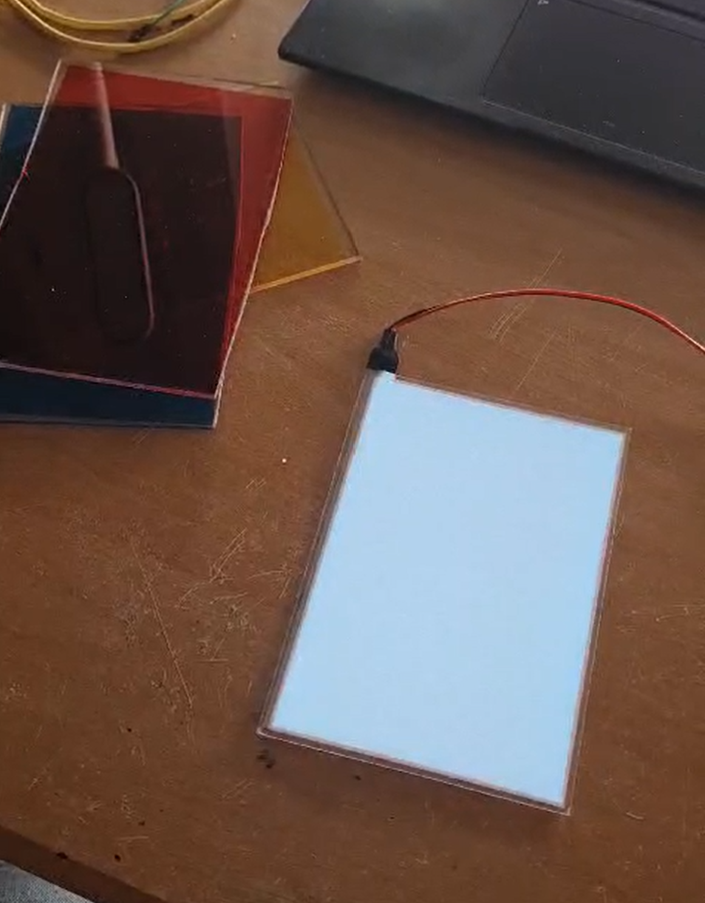
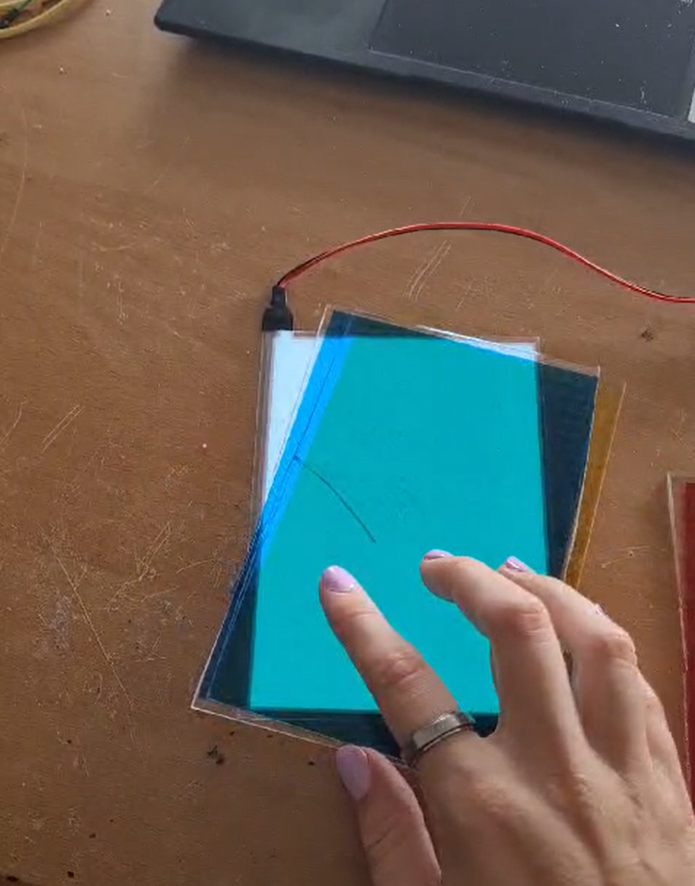

# Verlichtingstest met LED's
Bij mijn kleed Bedraden draden heb ik door mijn kleed glasvezel draden gestoken die ik direct op een LED geplaatst had. Dit werkt erg goed maar, het leverde veel rest materiaal op en het kost veel tijd ik wil testen of dit op een andere manier kan. 

## Glasvezel
Ik heb kleine spijkertjes van de glasvezel gemaakt door glas vezel wat ik over had te herbruiken. Deze stukjes heb ik aan de onderkant gesmolten zodat ze een platte onderkant kregen net als een soort spijkertjes. 

<div style="display: flex; justify-content: space-between;">
    
</div>

Deze kunnen door het kleed geduwd worden zonder er aan de andere kant uit te vallen. 

<div style="display: flex; justify-content: space-between;">
    
    
    
</div>

## LED-strips
#### DIY

Ik heb een flexibele Led matrix besteld maar moet wachten op de levering. Daarom heb ik geëxperimenteer met mijn eigen led matrix maken van LED-strips. 

<div style="display: flex; justify-content: space-between;">
    
    
</div>

De lED-stips heb ik aangesloten op een arduino waardoor ik tegen de lampjes kan zeggen wat ze moeten doen. 

#### flexibele Led matrix

De flexibele Led matrix is inmiddels ook binnen gekomen en daar heb ik de zelfde testen mee gedaan als de matrix die ik zelf gemaakt had.

Ik heb eerst gekeken of alle LEDjes werkte door alles rood op te laten lichten. Daarna heb ik door middel van groen en rood bepaald wat het eerste LEDje is in het circuit en het laatste LEDje. (Groen is de eerste en rood de laatste)

<div style="display: flex; justify-content: space-between;">
    
    
</div>

Op de volgende foto's zie je hoe flexibel de matrix is.

<div style="display: flex; justify-content: space-between;">
    
    
    
</div>


### Samenvoegen

Ik heb de LED verlichting achter het kleedje geplakt om te testen of het licht goed genoeg door de glasvezel reflecteert. 

<div style="display: flex; justify-content: space-between;">
    
    
</div>

Dit doet het maar het werkt het best als de verlichting iets van het kleed af zit. 

**Oplossingen**
1. Meer led lampjes naast elkaar.
2. Glasvezel minder willekeurig door het kleed.
3. Een kleine afstand tussen het kleed en de LED-verlichting.

Ik heb het kleed eerst gelijmd met latex lijm dit droogt doorzichtig op.

<div style="display: flex; justify-content: space-between;">
    
</div>

Toen dit opgedroogd was heb ik flexibele matrix hierachter geplaatst om te zien hoe het licht er doorheen ging. Het voordeel van de flexibele matrix is dat hij meer ledjes heeft en daarom dus meer oppervlakte van het kleed belicht.

<div style="display: flex; justify-content: space-between;">
    
    
    
</div>

De volgende foto's zijn van de zelfde test maar dan met een plexiglas plaat tussen de ledjes en het kleed.

<div style="display: flex; justify-content: space-between;">
    
    
</div>

# Led matrix aansluiten esp

## Esp

Toen het aansluiten op de Arduino gelukt was wilde ik dit gaan proberen met de Esp. Dit bleek alleen moeilijker dan verwacht.
Het eerste waar ik achter gekomen ben is dat de library *Adafruit_NeoPixel.h* niet werkt op de esp maar *FastLED.h* wel. Ook levert de esp maar 3.3V wat niet genoeg is voor de LED matrix die heeft namelijk 5V nodig. 

Om dit op te lossen heb ik de stroom vanuit de Arduino gebruikt voor de LED matrix en de esp als Arduino op een common ground gezet. Hierdoor krijgt de matrix genoeg stroom en kan de esp deze aansturen. dit heb ik gedaan door de matrix volledig aan te zetten. Hieronder zie je hiervan de code. De rest van dit onderzoek kun je lezen onder sensoren omdat ik voor de besturing van de Led matrix ook knoppen, distance- en druk sensoren ben gaan gebruiken. [Linktekst](/onderzoek/Sensor.md#arduino)

### volledig

```
#include <FastLED.h>

#define LED_PIN     14
#define NUMPIXELS   256  // 16x16 matrix
#define BRIGHTNESS  20

CRGB leds[NUMPIXELS];

void setup() {
  Serial.begin(115200);
  FastLED.addLeds<NEOPIXEL, LED_PIN>(leds, NUMPIXELS);
  FastLED.setBrightness(BRIGHTNESS);
  fill_solid(leds, NUMPIXELS, CRGB(0, 255, 0));
  FastLED.show();
  Serial.println("Yea 2");
}

void loop() {

}
```

## Lichtplaat

Ik heb kleine testjes gemaakt met een Lichtplaat en kleur folie.

<div style="display: flex; justify-content: space-between;">
    
</div>

<div style="display: flex; justify-content: space-between;">
    
    
    
</div>

<div style="display: flex; justify-content: space-between;">
    
    
    
</div>


# Materialen
Ik ben nu begonnen met onderzoek met glasvezel maar het gebruik van:
- Lichtgeleidende Garens
    - Lumina Yarn: Dit garen is speciaal ontworpen om licht door te geven. Het kan worden gebruikt in textiele projecten om een zachte, uniforme gloed te creëren.
    - Fiber Optic Yarn: Dit garen bevat fiber optics die licht doorgeven, wat zorgt voor een helder en direct licht dat zichtbaar is op specifieke punten van je werkstuk.
- Lichtdiffuserende Stoffen
    - Voile: Een lichte, doorzichtige stof die een zachte lichtverspreiding mogelijk maakt. Het kan worden gebruikt om een diffuse lichtstraling te creëren zonder de noodzaak van zware apparatuur.
    - Organza: Een transparante stof die licht diffundeert en een subtiele gloed toevoegt aan je project.
    - Diffuser Fabric: Speciale stoffen ontworpen om licht gelijkmatig te verspreiden, vaak gebruikt in verlichtingsdiffusors.
Sluit ik niet uit.


