# Wat voor producten bestaan er al

Ik heb diverse zoektermen gebruikt om hier meer informatie over te vinden. De zoektermen hadden te maken met Interactiviteit, verschillende technologieën, tuften, textiel en materiaal. Bij het online zoeken kon ik niks vinden soortgelijk aan het project dat ik gemaakt heb en kwam ik voornamelijk uit bij interactieve/smart textiele gebruikt in de mode, sport en healthcare. 

Je hebt verschillende soorten smart fabrics maar degene die voor mijn project handig zijn, Thermochromic Fabrics, Conductive Fabrics, Photochromic Textiles, Pressure-Sensitive Fabrics, Illuminated Fabrics en Temperature Regulating Fabrics. 

Voorbeelden van Smart fabrics in de mode zijn bijvoorbeeld:

    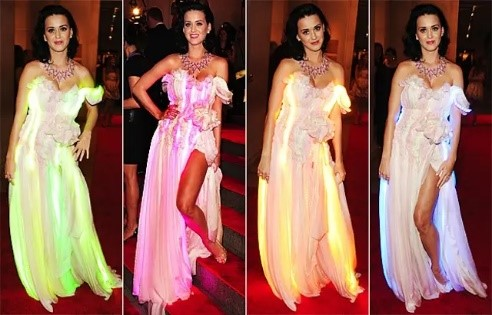

- **Jurken met LED's**: Een opmerkelijk voorbeeld is de LED-jurk van zangeres Katy Perry. De jurk met LED's lichtte op in verschillende kleuren en patronen en creëerde zo een verbluffend visueel effect. Deze casestudy toont het potentieel van slim textiel voor het creëren van niet alleen kleding, maar ook draagbare kunstwerken.

    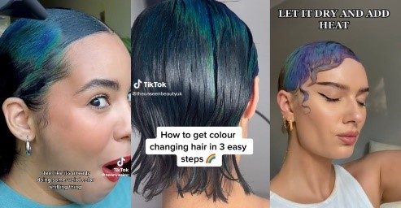

- **Kleurveranderende stoffen**: Een bedrijf genaamd The Unseen ontwikkelde een lijn leren accessoires en kledingstukken die van kleur veranderen als reactie op omgevingsfactoren zoals luchtdruk en temperatuur. Deze innovatie laat zien hoe slim textiel kan worden gebruikt om dynamische, interactieve kledingstukken te maken die reageren op de wereld om hen heen. 

    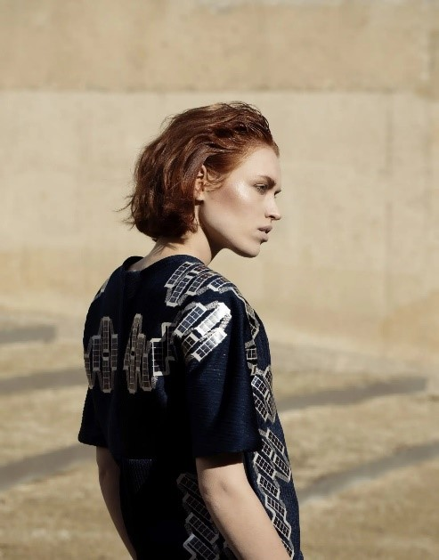

- **Kleding op zonne-energie**: Ontwerper Pauline van Dongen heeft in samenwerking met zonne-energie-experts een jas en jurk gemaakt waarin zonnepanelen zijn verwerkt. Deze kledingstukken kunnen zonne-energie gebruiken om mobiele apparaten op te laden, waardoor praktisch met mode wordt gecombineerd.

- **Mode voor gezondheidsmonitoring**: Ontwerpers zoals CuteCircuit hebben gewerkt aan kledingstukken die er niet alleen stijlvol uitzien, maar ook sensoren bevatten om gezondheidsindicatoren te monitoren. Dergelijke innovaties geven het potentieel aan van slim textiel voor preventieve gezondheidszorg en patiëntmonitoring. https://cutecircuit.com/hugshirt/
Wat je veel bij deze producten zien is dat het vlakke stoffen zijn en er dus bijna geen tot geen hoogteverschil is en je dus de sensor/microcontroller bijna direct kunt aanraken. Maar er was wel wat informatie te vinden over deze sensor/microcontroller. 
Op de website https://www.kobakant.at/DIY/ kun je veel informatie vinden over smart textiel en testen die hiermee gedaan zijn. 

Tuften en soortgelijke technologie heb ik niet kunnen vinden. Wel heb ik kunnen vinden dat het tuften zelf is overgenomen door een robot maar dat heeft niks te maken met elektronica in het kleed zelf. Verder zijn er diverse stijlen en methodes van tuften bijvoorbeeld Cut Pile Tufting, Loop Pile Tufting, Combination Tufting, Tufting with Multiple Yarn Colors, enz..

## Ontwerpers 
**Olafur Eliasson**

    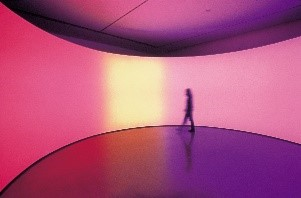

Bekend om zijn grootschalige installaties waarin hij vaak licht en ruimte gebruikt. Soms integreert hij ook textiel in zijn werk, wat relevant kan zijn voor jouw combinatie van technologie en materialen.

**Phillip Stearns**

    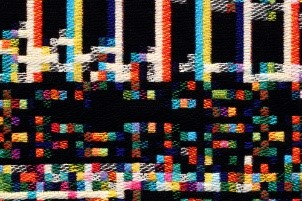

Hij werkt op het snijvlak van elektronica en textiel, met projecten waarin elektronische componenten worden verweven met stoffen. Zijn werk kan je helpen om verder te denken over hoe je technologie in textiel kunt integreren. 

**Nendo**

    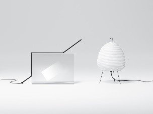

Dit Japanse designstudio staat bekend om het innovatieve gebruik van materialen en licht. Ze werken veel met minimalistische ontwerpen die functioneel en esthetisch aantrekkelijk zijn, wat relevant kan zijn voor jouw gebruik van LED's en licht in textiel. 

**Elizabeth Whelan Design**

    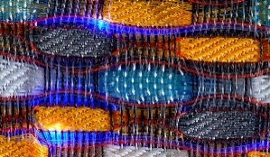

Dit project draait om het creëren van textiel met geïntegreerde LED-garens, wat overeenkomt met jouw idee om licht in een tapijt te verweven.

**Iris van Herpen**

    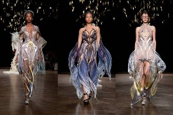

Een modeontwerper die technologie, kunst en mode samenbrengt. Haar werk met innovatieve materialen en technologieën kan je inspireren om nieuwe textiele toepassingen te bedenken.

**Clara Daguin**

    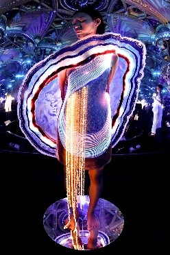

Bekend om haar verlichte textielontwerpen, zoals lichtgevende E-weave linten, wat aansluit bij jouw zoektocht naar manieren om licht in stoffen te integreren. 

**Ayala Serfaty**

    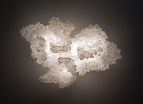

Een ontwerper die vaak werkt met sculpturale textiele vormen en verlichting, en die je kan inspireren met haar organische en innovatieve aanpak van licht en textiel.

**Anila Quayyum Agha**

    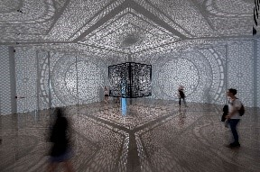

Ze gebruikt licht in haar artistieke installaties, waarbij ze schaduw en patronen combineert om ruimtes te transformeren. Dit kan je inspireren voor hoe je licht op creatieve manieren in een ruimte kunt gebruiken. 

## Overig onderzoek

Verder heb ik onderzoek gedaan door mijn project te delen op meerdere reddit kanalen en op een discord om te zien of andere niks tips voor mij hadden.

Deze platformen hielp mij in contact te komen met diverse mensen van over de hele wereld. 

Dit was het bericht:

Title: Fiber Optics and Capacitive Sensors in a Rug – Need Some Advice!
Hey everyone! How are you doing?
I’m working on a project where I’ve integrated fiber optic wires into a rug, connected to LED lights. The lights turn on when you stroke the rug thanks to capacitive sensors (TTP223). I haven’t used a microcontroller yet, but I’m considering it. However, I’m unsure how to connect each sensor and LED light, as it seems like they’d each need their own pin. Is that right?
To increase the range of the capacitive sensors, I soldered copper spirals onto them, which works, but sometimes the sensors trigger each other. I think this might be due to improper spacing. Any ideas on how to fix that?
Right now, the fiber optic wires are punched through the rug by hand, but I’m curious if anyone has suggestions for getting the light to shine through more effectively. I’m considering tufting the wires directly into the rug, but attaching the lights to the wires seems tricky.
I’m also at a point where I want to experiment more, so it doesn’t have to be with the materials I’ve already tried. If there are other alternatives to fiber optics that might work better, I’d love to hear about them!
Here are some photos of the process and the current state of the rug for a better look at what I’m working on.
I’d love any feedback or suggestions! You can see more of the process on my Instagram @rianne.schoenmacker.
Thanks so much in advance!
Lots of love,
Rianne xx

Ik heb dit bericht gepost op tufting, askelectronics, arduino en led

Een soort gelijk bericht had ik gepost in een discord van Nerdforge.

