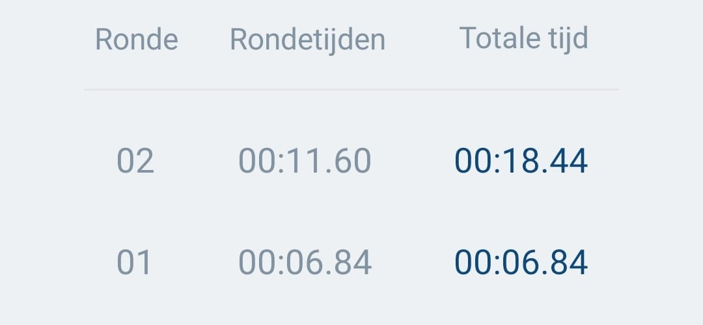

## Sensorintegratie

## Hoe kan ik het kleed laten activeren?

### 1. Gewichtssensoren / Druksensoren
- **Drukgevoelige Pads**: Ik kan druksensoren gebruiken die het licht aanzetten wanneer er druk op wordt uitgeoefend. Dit biedt een alternatieve manier om interactie te detecteren en het licht te activeren.
  - *Integratie*: Deze sensor kan worden gebruikt om gebieden te detecteren waar druk wordt uitgeoefend en vervolgens de verlichting te regelen. Ze kunnen ook meten hoeveel gewicht er op specifieke plekken van het kleed wordt geplaatst, waardoor het licht kan aangaan wanneer iemand erop staat of drukt.

- **Load Cell**:
  - *Wat is het?*: Load cells meten fysieke kracht, meestal druk of gewicht, en zetten deze om in elektrische signalen.
  - *Gebruik*: Ik kan ze onder het kleed plaatsen om het gewicht van een persoon te detecteren. In combinatie met een versterker (bijv. HX711) kunnen ze zelfs lichte druk meten.

- [Kapton + Copper Matrix](https://www.kobakant.at/DIY/?p=7443) Deze matrix kan worden gebruikt om druk te meten over een groter oppervlak, wat kan helpen bij het activeren van het licht op basis van waar iemand staat, zit of drukt.

### 2. Touchsensoren
- **Capacitive Touch Sensors**: Het gebruik van capacitive touch sensors maakt het mogelijk om het licht in te schakelen wanneer iemand het werkstuk aanraakt. Deze sensors detecteren veranderingen in elektrische capaciteit door aanraking en kunnen worden aangesloten op een microcontroller die de LEDs aanstuurt.
  - *Instellingen en Aanpassingen*: Het is belangrijk dat de sensors correct zijn afgesteld en gevoelig genoeg zijn om te reageren op aanraking zonder ongewenste valse triggers.

  - **Capacitieve Touchsensor (bijv. TTP223)**:
    - *Wat is het?*: Deze sensoren meten veranderingen in capacitieve lading wanneer ze worden aangeraakt. Ze reageren op lichte aanraking en kunnen discreet onder de stof van het kleed worden geplaatst.
    - *Gebruik*: Geschikt voor het detecteren van aanrakingen op het oppervlak van het kleed. Ze zijn eenvoudig te gebruiken en kunnen gemakkelijk worden geïntegreerd in een interactief lichtsysteem.

- **Force Sensitive Resistor (FSR)**:
  - *Wat is het?*: Dit is een druksensor die weerstand meet afhankelijk van de druk die erop wordt uitgeoefend. Hoe harder de druk, hoe lager de weerstand.
  - *Gebruik*: Ze kunnen onder het kleed of in de tuftlagen worden geplaatst om zachte druk of aanrakingen te meten. Ze reageren goed op zowel druk als aanraking.

- [Force Sensitive Resistor uitleg](https://www.youtube.com/watch?v=qjruYfwsOaI)  
  (Kan dit achter het hele kleed?)

### 3. Afstandssensoren
- **Bewegingssensoren**: Het gebruik van een bewegingssensor zoals een PIR-sensor (Passieve Infraroodsensor) kan helpen om licht te activeren op basis van beweging.
  - *Instelbare Sensitiviteit*: Het is belangrijk dat de sensitiviteit van de bewegingssensor kan worden aangepast om alleen te reageren op relevante bewegingen.

- **Ultrasone Afstandssensor (HC-SR04)**:
  - *Wat is het?*: Een ultrasone sensor die geluidsgolven gebruikt om de afstand tot een object te meten. Het is een betrouwbare en goedkope sensor voor korte afstanden.
  - *Gebruik*: Deze sensoren kunnen worden gebruikt om de afstand te meten en het licht in te schakelen wanneer iemand het kleed nadert. 

- **IR Afstandssensor (bijv. Sharp GP2Y0A02YK0F)**:
  - *Wat is het?*: Een infrarood afstandssensor die infrarood licht gebruikt om de afstand te meten. Hij werkt goed op korte tot middellange afstanden en is iets nauwkeuriger dan ultrasone sensoren.
  - *Gebruik*: Deze kan ook aan de rand van het kleed worden geplaatst om beweging te detecteren wanneer iemand in de buurt komt.

- **Kinect**:
  - *Wat is het?*: Een camera die kan worden gebruikt om beweging en personen te detecteren.

- **Sensor mm Wave**:
    - *Wat is het?*: Deze sensor kan worden gebruikt om beweging te detecteren, wat je in staat stelt om het licht te activeren wanneer iemand in de buurt komt. Het biedt een goede activeringsoptie zonder dat de gebruiker het kleed hoeft aan te raken.

- **Break Beam Sensor**:
      - *Wat is het?*: Deze sensor kan worden gebruikt om te detecteren wanneer een object de lichtstraal onderbreekt, waardoor het een trigger kan zijn voor verlichting.

### 4. Knop of Schakelaar
- **Handmatige Controle**: Voor een eenvoudigere benadering kun je een knop of schakelaar integreren in je werkstuk die het licht in- en uitschakelt. Dit kan een fysieke knop zijn die de verlichting regelt.

### 5. Microcontroller en Programmatie
- **Arduino of andere Microcontrollers**: Door een microcontroller zoals een Arduino te gebruiken, kan ik deze programmeren om de verschillende sensoren te lezen en op basis van die input de LEDs aan te sturen. Dit biedt veel flexibiliteit en controle over hoe en wanneer het licht aan en uit gaat.
- **Code Voorbeeld**: Ik kan een eenvoudige code schrijven die de sensorwaarden leest en op basis van die waarden de LEDs in- of uitschakelt. Er zijn veel voorbeelden en bibliotheken beschikbaar die me kunnen helpen met dit soort projecten.


### Touch Foil Screen
- **Wat is het?**: Met een touch foil screen kunnen gebruikers interactie hebben met het werkstuk door te tikken of te vegen. Het is een dunne, transparante folie die op het oppervlak van het werkstuk wordt aangebracht en die aanrakingen kan detecteren.
  - **Gebruik**: Dit type scherm maakt het mogelijk om een intuïtieve gebruikerservaring te creëren, waarbij gebruikers verschillende functies of instellingen kunnen activeren door aanraking.

### Scherm met Touch Screen
- **Wat is het?**: Een touch screen is een interactief scherm dat reageert op aanraking, waardoor gebruikers eenvoudig kunnen navigeren door verschillende opties. Het scherm kan verschillende lichtinstellingen en interacties aanbieden.
- **Gebruik**: Gebruikers kunnen met hun vingers op het scherm drukken om functies in te schakelen of instellingen aan te passen. Dit biedt een gebruiksvriendelijke interface voor het bedienen van verlichting en andere interactieve elementen in het werkstuk, zoals het kiezen van kleuren of het instellen van de helderheid.


## Kapton + Copper Matrix

Ik wil beginnen met het maken van de:
- [Kapton + Copper Matrix](https://www.kobakant.at/DIY/?p=7443)

Ik denk dat ik hiermee de beste resultaten kan halen. Ik heb de producten besteld en ga hier mee testen. Veel producten, zoals de geleidende verf, heb ik nog nooit mee gewerkt, dus zal ik ook beginnende experimenten mee doen om te kijken hoe het werkt en hoe het reageert.

### Wat ik hiervoor nodig/besteld en hoe ik getest heb:

- Kapton-tape: Dit is een dunne, flexibele, hittebestendige tape die vaak wordt gebruikt in elektronica. Het dient als de isolator in de matrix.

- Kopertape of : Zoals de naam al aangeeft, is deze tape gemaakt van koper. Het heeft uitstekende geleidende eigenschappen en is vaak dun en flexibel.
    - *Toepassing*: Kopertape wordt vaak gebruikt in elektronische projecten, zoals bij het maken van circuits op een klein oppervlak. Het is ook populair voor het afschermen van elektromagnetische interferentie (EMI).
    - *Geleidendheid*: Heeft over het algemeen een lagere weerstand en kan betere prestaties bieden voor het overdragen van elektrische signalen.
    - *Flexibiliteit en duurzaamheid*: Is redelijk flexibel, maar kan breken of vervormen als het te veel wordt belast of verkeerd wordt gebruikt.
    - *Prijsklasse*: Kan variëren in prijs, maar is meestal betaalbaar voor de meeste hobbyprojecten.

- Woven geleidende tape: Deze tape is gemaakt van geweven stoffen, meestal met geleidende materialen zoals koolstof of metaalcoatings. Het kan ook een combinatie van synthetische vezels en geleidend materiaal bevatten.
    - *Toepassing*: Woven geleidende tape wordt vaak gebruikt in toepassingen waarbij flexibiliteit en duurzaamheid belangrijk zijn, zoals bij het afschermen van kabels, het verbinden van geleiders of in textieltoepassingen. Het kan ook gebruikt worden voor het beschermen tegen statische elektriciteit.
    - *Geleidendheid*: Hoewel ook geleidend, kan de weerstand variëren afhankelijk van de gebruikte materialen en de dichtheid van de weving. Dit kan de effectiviteit beïnvloeden bij bepaalde toepassingen.
    - *Flexibiliteit en duurzaamheid*: Is meestal flexibeler en kan beter tegen belasting, wat het geschikt maakt voor gebruik in omgevingen waar beweging of vervorming kan optreden.
     - *Prijsklasse*: Kan vaak duurder zijn, afhankelijk van de gebruikte materialen en de specifieke toepassing.


<div style="display: flex; justify-content: space-between;">
    
    
    
</div>

<div style="display: flex; justify-content: space-between;">
    
    
    
</div>

- Elektrische geleidende verf: Deze verf is gemaakt van een bindmiddel waarin geleidende deeltjes, zoals koolstof, zilver of koper, zijn opgelost. Dit maakt het mogelijk om een geleidende laag te creëren wanneer de verf droogt.
   - *Toepassing*: Elektrische geleidende verf wordt vaak gebruikt voor het aanbrengen van elektrische verbindingen op niet-conventionele oppervlakken, zoals kunststof, hout of textiel. Het is ook handig voor het maken van zelfgemaakte schakelingen, het repareren van printplaten, en het creëren van geleidende patronen voor sensor- of touchscreen-toepassingen.
   - *Geleidendheid*: Hoewel het geleidend is, kan de geleidbaarheid variëren afhankelijk van de gebruikte deeltjes en de concentratie. De geleidbaarheid is doorgaans lager dan die van kopertape of woven geleidende tape, wat betekent dat het minder geschikt is voor toepassingen waar hoge prestaties of lage weerstand vereist zijn.
   - *Flexibiliteit en duurzaamheid*: Wanneer het goed is aangebracht en volledig is uitgehard, kan de verf redelijk flexibel zijn, maar kan deze ook breken of schilferen bij te veel belasting. De duurzaamheid hangt sterk af van de ondergrond en de omgeving waarin het wordt gebruikt.
   - *Prijsklasse*: De prijs varieert afhankelijk van de kwaliteit en de samenstelling van de verf, maar het kan over het algemeen duurder zijn dan kopertape, vooral bij gebruik van hoogwaardige geleidende materialen zoals zilver.

<div style="display: flex; justify-content: space-between;">
    
    
    
</div>

- Solderen: Solderen is een proces waarbij een soldeertin (meestal een legering van tin en lood, of tin en zilver) wordt verwarmd tot het smelt en vervolgens wordt gebruikt om twee of meer elektrische verbindingen aan elkaar te hechten.

- Draden of kabels: Om de kopertape of geleidende verf aan te sluiten op de elektronische componenten (zoals een microcontroller).

- Microcontroller (bijv. Arduino of ESP): Deze is nodig om de signalen van de matrixsensor te verwerken en verdere acties (zoals het activeren van verlichting) aan te sturen.

Ik ben begonnen met de kopertape de Matrix te maken op karton. Ik heb de kopertape bevestigd en daaraan draden gesoldeerd. Vervolgens heb ik getest of het de stroom nog wel leidde door dit te meten met een multimeter.

<div style="display: flex; justify-content: space-between;">
    
    
    
</div>

<div style="display: flex; justify-content: space-between;">
    
    
</div>

Helaas werkt mijn code nog niet dus ben er nog druk mee bezig maar het is wel gelukt een soort meting te maken. 

<div style="display: flex; justify-content: space-between;">
    
</div>

Na mijn code meerdere keren opnieuw proberen, heb ik besloten een paar stappen terug te gaan en na te maken wat ook gedaan is op [Kapton + Copper Matrix](https://www.kobakant.at/DIY/?p=7443). Door dit te doen hoop ik de code beter te kunnen begrijpen en te kunnen opschalen in plaats van gelijk groter te willen en proberen zonder dat ik weet wat ik doe.

Ik ben dus stap voor stap begonnen. Eerst heb ik de Kapton tape dubbel geplakt om er een film van te hebben zonder plakkende kanten, om vervolgens daar kopertape op te plakken met de zelfde afstand er tussen. Dit heb ik gedaan door tape in strookjes te snijden in de zelfde breedte als de tape. 

<div style="display: flex; justify-content: space-between;">
    
    
        
    
      
</div>

Daarna heb ik 3 vierkantjes uitgesneden en heb ik op een overig stukje geoefend met solderen om het vervolgens op de twee vierkante stukjes te doen. 

<div style="display: flex; justify-content: space-between;">
    
        
      
    
</div>

De volgende stap is het verbinden van mijn esp omdat dat ook gedaan wordt in mij voorbeeld.
De esp koppelen aan Arduino was even uitzoeken maar uiteindelijk heb ik deze [video](https://www.youtube.com/watch?v=BtSE0TeybfI) gevonden die het proces uitlegde. 

Helaas werkte de code van mijn voorbeeld website niet gelijk helemaal maar dit is de bedoeling ervan.

Ik sluit de kolommen en rijen aan op de volgende pinnen.

```
int rows[] = {36, 39, 34, 35, 32, 33, 25}; 
int cols[] = {0, 4, 16, 17, 5, 18, 19};
```

De rijen zitten op analoge pinnen en de kolommen op digitale pinnen. De digitale pinnen kunnen alleen aangeven of een verbinding hoog of laag is; analoge ingangspinnen kunnen de exacte spanningswaarde lezen. De analoge pinnen ontvangen dus in dit geval en de digitale pinnen zenden. Het is de bedoeling dat deze op elkaar komen te liggen met een stuk velostat er tussen. *Velostat* is drukgevoelig: knijpen of drukken vermindert de weerstand en is daarom handig voor het maken van flexibele sensoren.

De rijen moeten dus altijd 0 zijn en de kolommen zijn 3.3 volt. Als je druk zet op de sensor verminderd de weerstand van de velostat en wordt er dus stroom doorgegeven van de kolommen naar de rijen. Dit gebeurt alleen niet helemaal, de rijen geven altijd een diverse en hoge weerstand. Dit wordt ook wel floating values genoemd. 

Bij het testen in de progressing werkte het een beetje maar hij leek niet accuraat te zijn en ook steeds verbinding te krijgen op andere punten. 

<div style="display: flex; justify-content: space-between;">
    
        
      
</div>

Omdat de rijen 'floating' zijn wat storingen veroorzaakte. Om dit te proberen te voorkomen, heb ik deze rijen via een weerstand verbonden met de ground pin. Door de weerstand ontstaat een 'pull-down' effect, dat ervoor zorgt dat de rijen standaard een lage (0V) spanning hebben wanneer ze niet actief worden aangestuurd.

<div style="display: flex; justify-content: space-between;">
    
        
</div>

Dit is de code die ik hierbij gebruikte heb om het te laten werken.

##### Arduino IDE
```
/*
Matrix: Kapton + Copper
A simple pressure sensor matrix made from two Kapton film sheets with
7×7 copper tape traces and a piece of Velostat or Eeonyx piezoresistive
material in between.
*/

#define numRows 7
#define numCols 7
#define sensorPoints (numRows * numCols)

// ESP32-WROOM-32 Analog and Digital pin definitions
int rows[] = {36, 39, 34, 35, 32, 33, 25}; // Analog
int cols[] = {0, 4, 16, 17, 5, 18, 19}; // GPIO
int incomingValues[sensorPoints]={0};

void setup() {
    //Set all rows to INPUT_PULLDOWN to prevent floating values
    for (int i = 0; i < numRows; i++) {
        pinMode(rows[i], INPUT);
    }
    for (int i = 0; i < numCols; i++) {
        pinMode(cols[i], INPUT);
    }

    Serial.begin(9600);
    delay(1000);

    // pinMode(36, INPUT);
    // Serial.println(analogRead(36));
}

void loop() {
    // Reset incoming values

    for (int i = 0; i < sensorPoints; i++) {
        incomingValues[i] = 0;
    }

    // Iterate through each column
    for (int colCount = 0; colCount < numCols; colCount++) {
        pinMode(cols[colCount], OUTPUT);
        digitalWrite(cols[colCount], HIGH);

        // Read values from all rows in the current column
        for (int rowCount = 0; rowCount < numRows; rowCount++) {
            int rawValue = analogRead(rows[rowCount]);
            if (rawValue < 20) {
                incomingValues[colCount * numRows + rowCount] = 0;
            } else {
                incomingValues[colCount * numRows + rowCount] = rawValue;
            }
        }
        digitalWrite(cols[colCount], LOW);
        pinMode(cols[colCount], INPUT);
    }

    // Print the incoming values of the sensor grid
    for (int i = 0; i < sensorPoints; i++) {
        Serial.print(incomingValues[i]);
        if (i < sensorPoints - 1) {
            Serial.print("\t");
        }
    }

    Serial.println();
    delay(100);  // Adjusted delay for stability
}
```
##### Processing
```
import processing.serial.*;

Serial myPort; // The serial port
int maxNumberOfSensors = 49;
float[] sensorValue = new float[maxNumberOfSensors]; // Global variable for storing mapped sensor values
float[] previousValue = new float[maxNumberOfSensors]; // Previous values for smoothing
int rectSize = 0;

void setup() {
    size(600, 600); // Set up the window
    rectSize = width / 7;

   println(Serial.list()); // List all the available serial ports
    String portName = Serial.list()[0]; // Adjust if needed, to pick the correct port
    myPort = new Serial(this, portName, 9600);
    myPort.clear();
    myPort.bufferUntil('\n'); // Wait for newline before triggering serialEvent
    background(255); // Set initial background
    smooth(); // Turn on antialiasing
    rectMode(CORNER);
}

void draw() {
    // Clear the screen each frame
    background(255); // Prevent flickering by refreshing the background

    // Reset rectY at the start of each draw
    int rectY = 0; 

    // Iterate through each sensor and draw rectangles
    for (int i = 0; i < maxNumberOfSensors; i++) {
        // Apply smoothing to the sensor values
        sensorValue[i] = 0.9 * sensorValue[i] + 0.1 * previousValue[i];
        fill(sensorValue[i]);
        rect(rectSize * (i % 7), rectY, rectSize, rectSize); // Draw rectangle

        if ((i + 1) % 7 == 0) {
            rectY += rectSize; // Move to next row after 7 columns
        }
    }
}

void serialEvent(Serial myPort) {
    String inString = myPort.readStringUntil('\n'); // Get the ASCII string
    if (inString != null) { // If it's not empty
        inString = trim(inString); // Trim off any whitespace
        int incomingValues[] = int(split(inString, "\t")); // Convert to an array of ints
        if (incomingValues.length <= maxNumberOfSensors && incomingValues.length > 0) {
            for (int i = 0; i < incomingValues.length; i++) {
                previousValue[i] = map(incomingValues[i], 0, 1023, 0, 255);
            }
        }
    }
}
```

Waarna hij best accuraat werkte, niet ideaal, maar dat komt waarschijnlijk ook door de manier dat de rijen en kolommen op elkaar lagen. Het raster is zwart en bij pressure gaat hij van lichtgrijs naar wit.

<div style="display: flex; justify-content: space-between;">
    
        
</div>

Ik heb geprobeerd de sensor te koppelen aan de licht matrix. Helaas is dit nog zonder succes gegaan. 

<div style="display: flex; justify-content: space-between;">
    
        
</div>

Omdat dit zonder succes is gegaan ben ik met kleinere stapjes begonnen door de LED matrix eerst aan te sluiten op een knop in combinatie met een Arduino.

## Arduino
### Knop

Ik heb de knop geconnect aan de Arduino en met de de volgende code kon ik nu een led aan en uit zetten;

```
#include <Adafruit_NeoPixel.h>

// Pin definities
#define PIN 6           // Pin verbonden met de NeoPixel data in
#define BUTTON_PIN 2    // Pin verbonden met de knop


// NeoPixel matrix grootte
#define NUMPIXELS 256   // 16x16 matrix = 256 pixels
#define BRIGHTNESS 50   // Pas de helderheid aan (0-255)

// Maak een instance van de NeoPixel
Adafruit_NeoPixel pixels(NUMPIXELS, PIN, NEO_GRB + NEO_KHZ800);

// Variabele voor de knopstatus
bool ledsOn = false;

// Variabele om de specifieke LED index te kiezen (bijv. LED op rij 5, kolom 5)
int row = 5;
int col = 5;
int ledIndex = (row * 16) + col; // Bereken de LED index voor rij 5, kolom 5

void setup() {
  // Initializeer de NeoPixel
  pixels.begin();
  pixels.setBrightness(BRIGHTNESS); // Optioneel: pas de helderheid aan
  pixels.show();  // Initialiseert alle pixels naar 'uit'

  // Instellen van de knop pin
  pinMode(BUTTON_PIN, INPUT_PULLUP);  // Interne pull-up resistor gebruiken
}

void loop() {
  // Lees de knopstatus (LOW betekent ingedrukt door de interne pull-up resistor)
  int buttonState = digitalRead(BUTTON_PIN);

  // Controleer of de knop is ingedrukt
  if (buttonState == LOW) {
    // Wacht even om te voorkomen dat het contact blijft stuiteren
    delay(50);

    // Wissel de status van de LEDs
    ledsOn = !ledsOn;

    // Als de LEDs aan moeten gaan
    if (ledsOn) {
      pixels.setPixelColor(ledIndex, pixels.Color(255, 0, 0)); // Zet de specifieke LED op rood
    } else { // Als de LEDs uit moeten gaan
      pixels.clear(); // Alle LEDs uit
    }
    pixels.show(); // Toon de nieuwe status

    // Wacht totdat de knop wordt losgelaten om opnieuw te kunnen activeren
    while (digitalRead(BUTTON_PIN) == LOW) {
      delay(10); // Anti-bounce
    }
  }
}
```
Vervolgens wilde in de 4 leds in het midden aan zetten en bij elke klik alles uit zetten en bij de volgende klik de aansluitende Leds us 4x4 leds aan zetten enz..

Omdat de leds optellen in een zig zag patroon moest ik dus zorgen dat er in de code juist vermeld staat dat de juiste leds aan gaan.

De volledige code hiervoor is:

```
#include <Adafruit_NeoPixel.h>

// Pin definities
#define PIN 6           // Pin verbonden met de NeoPixel data in
#define BUTTON_PIN 2    // Pin verbonden met de knop


// NeoPixel matrix grootte
#define NUMPIXELS 256   // 16x16 matrix = 256 pixels
#define BRIGHTNESS 50   // Pas de helderheid aan (0-255)

// Maak een instance van de NeoPixel
Adafruit_NeoPixel pixels(NUMPIXELS, PIN, NEO_GRB + NEO_KHZ800);

// Variabele voor de knopstatus
bool ledsOn = false;

// Huidig niveauc:\Users\riann\OneDrive\Documenten\Studie\St joost\Leerjaar 4\Eigenproject semester 7\Arduino\sensor\pressure_sensor.ino\pressure_sensor.ino.ino van het blokje
int level = 1; // Begin met een 3x3 blokje

void setup() {
  // Initializeer de NeoPixel
  pixels.begin();
  pixels.setBrightness(BRIGHTNESS); // Optioneel: pas de helderheid aan
  pixels.show();  // Initialiseert alle pixels naar 'uit'

  // Instellen van de knop pin
  pinMode(BUTTON_PIN, INPUT_PULLUP);  // Interne pull-up resistor gebruiken
}

void loop() {
  // Lees de knopstatus (LOW betekent ingedrukt door de interne pull-up resistor)
  int buttonState = digitalRead(BUTTON_PIN);

  // Controleer of de knop is ingedrukt
  if (buttonState == LOW) {
    // Wacht even om te voorkomen dat het contact blijft stuiteren
    delay(50);

// Wissel de status van de LEDs
    if (ledsOn) {
      // Als de LEDs aan zijn, maak ze uit
      pixels.clear();
      ledsOn = false;
    } else {
      // Als de LEDs uit zijn, maak ze aan
      ledsOn = true;

      // Bepaal de grootte van het blokje
      int size = level * 2; // Groottes: 3, 5, 7, ...

      // Beginpositie voor het blokje in het midden van de matrix
      int startRow = 8 - (size / 2); // Start rij
      int startCol = 8 - (size / 2); // Start kolom

      // Loop door de rijen en kolommen om het blokje aan te zetten
      for (int row = startRow; row < startRow + size; row++) {
        for (int col = startCol; col < startCol + size; col++) {
          int ledIndex;
          // Bepaal de index afhankelijk van of de rij even of oneven is
          if (row % 2 == 0) {
            // Even rij: van links naar rechts
            ledIndex = (row * 16) + col; // Bereken de LED index voor elke rij en kolom
          } else {
            // Oneven rij: van rechts naar links
            ledIndex = (row * 16) + (15 - col); // Bereken de LED index voor elke rij en kolom
          }
          pixels.setPixelColor(ledIndex, pixels.Color(255, 0, 0)); // Zet de specifieke LED op rood
        }
      }

      // Verhoog het niveau voor de volgende keer
      level++;
      if (level > 8) { // Reset als het niveau hoger is dan 3 (7x7 blokje)
        level = 1;
      }
    }

    pixels.show(); // Toon de nieuwe status

    // Wacht totdat de knop wordt losgelaten om opnieuw te kunnen activeren
    while (digitalRead(BUTTON_PIN) == LOW) {
      delay(10); // Anti-bounce
    }
  }
}
```

In afbeeldingen hoe dit er dan uit ziet:

<div style="display: flex; justify-content: space-between;">
    
        
      
      
</div>

Toen dit gelukt was met een knop probeerde ik het met een druk sensor

### Druk sensor

Het doel hiervan was het zelfde met de knop maar dan met druk. Hoe meer druk je uit oefent hoe groter het vlak word die aan staat.

Ik heb dit weer in kleine stapjes aangepakt dus eerst een led laten aan gaan en daarna gezorgd dat hij groter werd door de druk.

De uiteindelijke code hiervoor is:

```
#include <Adafruit_NeoPixel.h>

// Pin definities
#define PIN 6           // Pin verbonden met de NeoPixel data in
#define PRESSURE_PIN A0    // Pin verbonden met de knop


// NeoPixel matrix grootte
#define NUMPIXELS 256   // 16x16 matrix = 256 pixels
#define BRIGHTNESS 50   // Pas de helderheid aan (0-255)

// Maak een instance van de NeoPixel
Adafruit_NeoPixel pixels(NUMPIXELS, PIN, NEO_GRB + NEO_KHZ800);

// Drempelwaarden voor druk
#define THRESHOLD_1 100 // Drempelwaarde voor 2x2 blok
#define THRESHOLD_2 200  // Drempelwaarde voor 4x4 blok
#define THRESHOLD_3 300 // Drempelwaarde voor 6x6 blok
#define THRESHOLD_4 400  // Drempelwaarde voor 8x8 blok
#define THRESHOLD_5 500  // Drempelwaarde voor 10x10 blok
#define THRESHOLD_6 600  // Drempelwaarde voor 12x12 blok
#define THRESHOLD_7 700  // Drempelwaarde voor 14x14 blok
#define THRESHOLD_8 800  // Drempelwaarde voor 16x16 blok


void setup() {
  // Initializeer de NeoPixel
  pixels.begin();
  pixels.setBrightness(BRIGHTNESS); // Optioneel: pas de helderheid aan
  pixels.show();  // Initialiseert alle pixels naar 'uit'
  Serial.begin(9600); // Initialiseer de seriële monitor
}

void loop() {
   int pressureValue = analogRead(PRESSURE_PIN); // Lees de waarde van de druk sensor

  // Print de waarde van de sensor naar de seriële monitor
  Serial.print("Pressure Value: ");
  Serial.println(pressureValue);

  // Controleer de druk en bepaal de grootte van het blokje
  if (pressureValue > THRESHOLD_8) {
    // 16x16 block
    setBlock(0, 0, 16);
  } else if (pressureValue > THRESHOLD_7) {
    // 14x14 block
    setBlock(1, 1, 14);
  } else if (pressureValue > THRESHOLD_6) {
    // 12x12 block
    setBlock(2, 2, 12);
  } else if (pressureValue > THRESHOLD_5) {
    // 10x10 block
    setBlock(3, 3, 10);
  } else if (pressureValue > THRESHOLD_4) {
    // 8x8 block
    setBlock(4, 4, 8);
  } else if (pressureValue > THRESHOLD_3) {
    // 6x6 block
    setBlock(5, 5, 6);
  } else if (pressureValue > THRESHOLD_2) {
    // 4x4 block
    setBlock(6, 6, 4);
  } else if (pressureValue > THRESHOLD_1) {
    // 2x2 block
    setBlock(7, 7, 2);
  } else {
    // Geen druk, maak alle LEDs uit
    pixels.clear();
  }

  pixels.show(); // Toon de nieuwe status
  delay(100); // Kleine vertraging voor stabiliteit
}

// Functie om een blok LED's in te schakelen
void setBlock(int startRow, int startCol, int size) {
  for (int row = startRow; row < startRow + size; row++) {
    for (int col = startCol; col < startCol + size; col++) {
      int ledIndex = (row * 16) + col; // Bereken de LED-index
      pixels.setPixelColor(ledIndex, pixels.Color(255, 0, 0)); // Zet de specifieke LED op rood
    }
  }
}
```
In afbeeldingen is dit niet goed te zien dus ik ben nog aan het bedenken hoe ik de video's hier kan uploaden of het best naar kan verwijzen.

Toen dit allemaal gelukt was ben ik begonnen met het connecten van een distance sensor.

### Distance sensor

De distance sensor code lijkt heel erg op de druk sensor alleen gaat het alleen niet om kracht maar afstand. 

Dit is de code die ik hiervoor uiteindelijk gebruikt heb:

```
#include <Adafruit_NeoPixel.h>

// Pin definities
#define PIN 6           // Pin verbonden met de NeoPixel data in
#define TRIG_PIN 9      // Pin verbonden met de Trig pin van de afstandssensor
#define ECHO_PIN 10     // Pin verbonden met de Echo pin van de afstandssensor

// NeoPixel matrix grootte
#define NUMPIXELS 256   // 16x16 matrix = 256 pixels
#define BRIGHTNESS 50   // Pas de helderheid aan (0-255)

// Maak een instance van de NeoPixel
Adafruit_NeoPixel pixels(NUMPIXELS, PIN, NEO_GRB + NEO_KHZ800);

// Drempelwaarden voor afstand
#define THRESHOLD_1 5 // Drempelwaarde voor 2x2 blok
#define THRESHOLD_2 10 // Drempelwaarde voor 4x4 blok
#define THRESHOLD_3 15 // Drempelwaarde voor 6x6 blok
#define THRESHOLD_4 20  // Drempelwaarde voor 8x8 blok
#define THRESHOLD_5 25  // Drempelwaarde voor 10x10 blok
#define THRESHOLD_6 30  // Drempelwaarde voor 12x12 blok
#define THRESHOLD_7 35  // Drempelwaarde voor 14x14 blok
#define THRESHOLD_8 40  // Drempelwaarde voor 16x16 blok

// Variabele om de grootte van het blok te bewaren
int currentSize = 0;

void setup() {
  Serial.begin(9600);
  pixels.begin(); // Initialiseer de NeoPixel matrix
  pixels.setBrightness(BRIGHTNESS);
  
  // Pin modes instellen
  pinMode(TRIG_PIN, OUTPUT);
  pinMode(ECHO_PIN, INPUT);
}

void loop() {
  // Afstand meten
  long afstand = meetAfstand();
  Serial.print("Afstand: ");
  Serial.println(afstand);

  // Afstand lezen en omzetten naar een blokgrootte
  if (afstand < THRESHOLD_1) {
    currentSize = 16; // 16x16 blok
  } else if (afstand < THRESHOLD_2) {
    currentSize = 14; // 14x14 blok
  } else if (afstand < THRESHOLD_3) {
    currentSize = 12; // 12x12 blok
  } else if (afstand < THRESHOLD_4) {
    currentSize = 10; // 10x10 blok
  } else if (afstand < THRESHOLD_5) {
    currentSize = 8;  // 8x8 blok
  } else if (afstand < THRESHOLD_6) {
    currentSize = 6;  // 6x6 blok
  } else if (afstand < THRESHOLD_7) {
    currentSize = 4;  // 4x4 blok
  } else if (afstand < THRESHOLD_8) {
    currentSize = 2;  // 2x2 blok
  } else {
    currentSize = 0;  // Geen blok als de afstand te groot is
  }

  // De LED matrix aansturen op basis van de grootte van currentSize
  tekenBlok(currentSize);
  delay(500); // Korte vertraging om overbelasting van de seriële monitor te voorkomen
}

long meetAfstand() {
  // Trigger de afstandssensor
  digitalWrite(TRIG_PIN, LOW);
  delayMicroseconds(2);
  digitalWrite(TRIG_PIN, HIGH);
  delayMicroseconds(10);
  digitalWrite(TRIG_PIN, LOW);

  // Lees de echo tijd
  long duration = pulseIn(ECHO_PIN, HIGH);
  // Bereken de afstand in cm (de snelheid van geluid is 34300 cm/s)
  long afstand = duration * 0.034 / 2; 
  return afstand;
}

// Functie om een blok LED's in te schakelen
void setBlock(int startRow, int startCol, int size) {
  for (int row = 0; row < size; row++) {
    for (int col = 0; col < size; col++) {
      int ledIndex = ((startRow + row) * 16) + (startCol + col); // Bereken de LED-index
      pixels.setPixelColor(ledIndex, pixels.Color(255, 0, 0)); // Zet de specifieke LED op rood
    }
  }
}

void tekenBlok(int size) {
  pixels.clear(); // Wis de matrix

  if (size > 0) {
    int startRow = (16 - size) / 2; // Bepaal de start rij
    int startCol = (16 - size) / 2; // Bepaal de start kolom
    setBlock(startRow, startCol, size); // Roep de functie aan om het blok in te schakelen
  }
  
  pixels.show(); // Update de LED matrix
}
```
In afbeeldingen hoe dit er dan uit ziet:

<div style="display: flex; justify-content: space-between;">
    
        
      
      
</div>

Toen ik begreep hoe het werkt wilde ik dit op mijn esp gaan proberen.

## Esp
### knop

Dit bleek alleen moeilijker dan verwacht en ik begrijp niet helemaal waarom. Bij onderzoek LED kun je zien hoe ik alle leds heb aan gekregen via de esp. [ONDERZOEK LED](/onderzoek/LED.md#led-matrix-aansluiten-esp) 

Ik ben dit dus nog kleiner gaan aanpakken en ik heb de esp op een kop aangesloten en 1 led lampje. Dit heb ik gedaan door een tutorial te volgen van Robojax [video](https://www.youtube.com/watch?v=_tLesIbpB8U) Zo is het mij gelukt om de knop te gebruiken voor Toggle LED, Push ON, Push OFF.

In afbeeldingen hoe dit er dan uit ziet:

<div style="display: flex; justify-content: space-between;">
    
        
      
      
</div>

Op de laatste afbeelding zie je ook dat ik kon zien wanneer de knop uit stond en aan.

Omdat dit lukte wilde ik de led matix toevoegen aan de esp met button in plaats van dat ene led lichtje. Dit koste wat moeite maar is uiteindelijk gelukt. De reden dat het niet werkte kwam door een fout in de FastLED library door even goed zoeken op Reddit heb ik een post gevonden waar de maker van de FastLED library een pre release heeft gedeeld van de volgende update waar deze bug uit gehaald was. 

Ik ben vervolgens de oefeningen knop, druk sensor en distance sensor net als bij de Arduino gaan toepassen op de esp. Dit werkte zoals gehoopt. 

Omdat dit werkte besloot ik met de knop verder te experimenteren door een ademhalings oefening toe te passen die 7 seconde uit ademt en 11 seconde in ademt. Dit is te zien door licht dat midden in de LED matrix start met een blokje van 2x2 en eindigt als de volledige matrix 16x16 oplicht om vervolgens weer terug te gaan naar 2x2.

Toen dit werkte ben ik gaan testen met verschillende kleuren en hoe ik dit in de code moest gaan aangeven.

Ik wilde nog een knop toevoegen die het licht random aan deed en langzaam uit laat gaan. 

De uiteindelijke code vaan deze twee knoppen is dit geworden:

```
#include <FastLED.h>

#define LED_PIN        20
#define NUMPIXELS      256  // 16x16 matrix
#define SPARKLE_PIN    40    // Pin connected to the button for sparkle
#define SPARKLE_DELAY  200   // Delay between updates (in milliseconds)
#define FADE_RATE      5      // Amount to change brightness each cycle (lower for slower fade)
#define MAX_SPARKLES   60     // Maximum number of LEDs to light at the same time
#define MATRIX_WIDTH   16     // Width of the matrix
#define MATRIX_HEIGHT  16      // Height of the matrix
#define BREATHING_PIN  37     // Pin connected to the button for breathing
#define INHALE_TIME    7000   // Time to inhale (7 seconds)
#define EXHALE_TIME    11000  // Time to exhale (11 seconds)
#define BREATHING_DURATION (INHALE_TIME + EXHALE_TIME) // Total breathing duration for one cycle

CRGB leds[NUMPIXELS];
bool sparkleActive = false;        // State to control the sparkle effect
bool breathingActive = false;      // Is the breathing animation active?
bool lastSparkleButtonState = HIGH; // To track button state changes for sparkle
bool lastBreathingButtonState = HIGH; // To track button state changes for breathing
unsigned long lastSparkleButtonPress = 0; // For debouncing sparkle button
unsigned long lastBreathingButtonPress = 0; // For debouncing breathing button
const unsigned long debounceDelay = 200; // Debounce delay for buttons
uint8_t brightness[NUMPIXELS] = {0}; // Initialize brightness levels
bool increasing[NUMPIXELS] = {false}; // Initialize increasing/fading states
int activeCount = 0;                // Number of currently active LEDs
unsigned long breathingStartTime = 0;  // When breathing starts
int cycleCount = 0;                      // Counter for breathing cycles
const int maxCycles = 2;                 // Maximum number of cycles

// Function prototypes
void drawBlock(int level);
int getLedIndex(int row, int col);
CRGB getGradientColor(int level);

void setup() {
    Serial.begin(115200);
    FastLED.addLeds<WS2812B, LED_PIN>(leds, NUMPIXELS);
    FastLED.setBrightness(255);  // Set maximum brightness
    fill_solid(leds, NUMPIXELS, CRGB::Black);  // Turn off all LEDs initially
    FastLED.show();

    pinMode(SPARKLE_PIN, INPUT_PULLUP);
    pinMode(BREATHING_PIN, INPUT_PULLUP);  // Use internal pull-up for the button
}

void loop() {
    // Handle sparkle button
    bool currentSparkleButtonState = digitalRead(SPARKLE_PIN);
    // Check for sparkle button press to toggle the sparkle effect
    if (currentSparkleButtonState == LOW && lastSparkleButtonState == HIGH) {
        if (millis() - lastSparkleButtonPress > debounceDelay) { // Debounce logic
            // Allow toggle only if not breathing
            if (!breathingActive) {
                sparkleActive = !sparkleActive;  // Toggle sparkle effect state
                Serial.println(sparkleActive ? "Sparkle effect ON" : "Sparkle effect OFF");
                lastSparkleButtonPress = millis();  // Update last button press time

                // If turning off sparkle, reset brightness to 0
                if (!sparkleActive) {
                    fill_solid(leds, NUMPIXELS, CRGB::Black); // Ensure all LEDs are off
                    FastLED.show();
                    activeCount = 0; // Reset active count
                }
            }
        }
    }

    // Run sparkle effect if active
    if (sparkleActive) {
        sprinkle();  // Call the sparkle function
    }

    // Handle breathing button
    bool currentBreathingButtonState = digitalRead(BREATHING_PIN);
    // Check for breathing button press to start the breathing animation only if it's not active
    if (currentBreathingButtonState == LOW && lastBreathingButtonState == HIGH) {
        if (millis() - lastBreathingButtonPress > debounceDelay) { // Debounce logic
            if (!breathingActive) { // Start breathing only if not already active
                breathingActive = true;  // Set breathing animation active
                sparkleActive = false; // Turn off sparkle effect when breathing starts
                fill_solid(leds, NUMPIXELS, CRGB::Black); // Ensure all LEDs are off
                breathingStartTime = millis();  // Record the time breathing starts
                cycleCount = 0; // Reset cycle count
                Serial.println("Breathing started!"); // For debugging
            }
            lastBreathingButtonPress = millis(); // Update last button press time
        }
    }

    // If breathing animation is active, run it for the specified cycles
    if (breathingActive) {
        if (cycleCount < maxCycles) { // Check if we have completed the max cycles
            if (millis() - breathingStartTime < BREATHING_DURATION) {
                breathingAnimation();  // Run the breathing animation
            } else {
                breathingStartTime = millis(); // Reset start time for the next cycle
                cycleCount++; // Increment the cycle count
                Serial.print("Cycle completed: ");
                Serial.println(cycleCount); // For debugging
            }
        } else {
            breathingActive = false;  // Stop breathing after the maximum cycles
            fill_solid(leds, NUMPIXELS, CRGB::Black);  // Turn off all LEDs
            FastLED.show();
            Serial.println("Breathing animation stopped!"); // For debugging
        }
    }

    FastLED.show();  // Update the LED matrix

    lastSparkleButtonState = currentSparkleButtonState;  // Store the sparkle button state
    lastBreathingButtonState = currentBreathingButtonState; // Store the breathing button state
}

// Function to create a subtle sparkle effect
void sprinkle() {
    // Clear LEDs and prepare for sparkle effect
    fill_solid(leds, NUMPIXELS, CRGB::Black);

    // Randomly light up a few LEDs while respecting the MAX_SPARKLES limit
    for (int i = 0; i < NUMPIXELS; i++) {
        if (brightness[i] > 0) {
            // Adjust brightness
            if (increasing[i]) {
                brightness[i] += FADE_RATE; // Increase brightness
                if (brightness[i] >= 100) { // Max brightness reached
                    brightness[i] = 100; // Cap brightness
                    increasing[i] = false; // Start fading out
                }
            } else {
                brightness[i] -= FADE_RATE; // Decrease brightness
                if (brightness[i] <= 0) { // Min brightness reached
                    brightness[i] = 0; // Turn off LED
                    increasing[i] = true; // Reset to increasing
                    activeCount--;  // Reduce active count
                }
            }

            // Set LED color based on current brightness
            leds[i] = CRGB(255, 255, 0).fadeToBlackBy(255 - brightness[i]); // Apply brightness with color
        }
    }

    // Ensure we don't exceed the maximum number of sparkles
    if (activeCount < MAX_SPARKLES) {
        int ledToLight = random(0, NUMPIXELS);
        // Only light the LED if it's currently off
        if (brightness[ledToLight] == 0) {
            brightness[ledToLight] = 1;  // Start at low brightness
            increasing[ledToLight] = true; // Start increasing brightness
            activeCount++;  // Count this LED as active
        }
    }

    delay(SPARKLE_DELAY);  // Control the speed of the sparkle effect
}

void breathingAnimation() {
  unsigned long elapsedTime = millis() - breathingStartTime;

  // Determine current phase of breathing (1 for inhale, 2 for exhale)
  int currentPhase = (elapsedTime < INHALE_TIME) ? 1 : 2;

  // Calculate the level based on the phase and the elapsed time
  int level;
  if (currentPhase == 1) { // Inhale
    level = elapsedTime / (INHALE_TIME / 8); // 0 to 7 for levels 0 to 7 (2x2 to 16x16)
  } else { // Exhale
    level = 7 - ((elapsedTime - INHALE_TIME) / (EXHALE_TIME / 8)); // 7 to 0 for levels 7 to 0 (16x16 to 2x2)
  }

  level = constrain(level, 0, 8); // Ensure level stays between 0 and 7

  Serial.print("Current Level: "); // Debugging output
  Serial.println(level + 1); // Display level 1-8

  drawBlock(level);  // Light the matrix based on the current level

  FastLED.show();
}

// Function to draw a block based on the current level
void drawBlock(int level) {
  fill_solid(leds, NUMPIXELS, CRGB::Black);  // Clear the matrix first

  // Loop through each level from outermost to innermost
  for (int l = level; l >= 0; l--) {
    int size = (l + 1) * 2;  // Block sizes: 2x2, 4x4, 6x6, ..., 16x16
    int startRow = (MATRIX_HEIGHT - size) / 2;  // Start row for the block
    int startCol = (MATRIX_WIDTH - size) / 2;  // Start column for the block

    // Get the gradient color for the current level
    CRGB blockColor = getGradientColor(l);

    for (int row = startRow; row < startRow + size; row++) {
      for (int col = startCol; col < startCol + size; col++) {
        int ledIndex = getLedIndex(row, col);  // Calculate the LED index
        leds[ledIndex] = blockColor;  // Set the specific LED to the gradient color
      }
    }
  }
    FastLED.show();
}

CRGB getGradientColor(int level) {
  // Array of colors for each level
  CRGB colors[] = {
    CRGB::AliceBlue,     // Level 0: 
    CRGB::SteelBlue ,  // Level 1: 
    CRGB::RoyalBlue ,  // Level 2: 
    CRGB::MediumSlateBlue ,   // Level 3: 
    CRGB::DarkSlateBlue ,    // Level 4: 
    CRGB::MidnightBlue ,    // Level 5: 
    CRGB::MediumBlue ,  // Level 6: 
    CRGB::Navy ,    // Level 7: 
  };

  // Return the color for the current level (level 0 to 7)
  return colors[constrain(level, 0, 7)];
}

// Convert 2D x, y coordinates to the 1D index in the LED array
int getLedIndex(int row, int col) {
  return (row * MATRIX_WIDTH) + col;  // Adjust if your matrix wiring is different
}
```

<div style="display: flex; justify-content: space-between;">
    
        
      
      
      
      
      
</div>

Na deze testen heb ik opnieuw geprobeerd mijn zelf gemaakte Kapton + Copper Matrix te verbinden aan de Led-matrix en deze keer met meer succes. 

De code die ik gebruikt heb hiervoor staat hieronder:

```
#include <FastLED.h>

// Pin definitions for the LED matrix
#define LED_PIN 23      // Pin connected to the LED data in
#define NUMPIXELS 256   // 16x16 matrix = 256 pixels
#define BRIGHTNESS 50   // Adjust brightness (0-255)
#define LED_TYPE WS2812 // Specify the LED type
#define COLOR_ORDER GRB // Specify the color order

// Pressure sensor matrix definitions
#define numRows 7
#define numCols 7
#define sensorPoints (numRows * numCols)

// ESP32-WROOM-32 Analog and Digital pin definitions for pressure sensor
int rows[] = {36, 39, 34, 35, 32, 33, 25}; // Analog
int cols[] = {0, 4, 16, 17, 5, 18, 19}; // columns GPIO
int incomingValues[sensorPoints] = {0};

// Create an array to hold the LED data
CRGB leds[NUMPIXELS];

void setup() {
    // Initialize LED matrix
    FastLED.addLeds<LED_TYPE, LED_PIN, COLOR_ORDER>(leds, NUMPIXELS);
    FastLED.setBrightness(BRIGHTNESS);

    // Set all rows to INPUT_PULLDOWN to prevent floating values
    for (int i = 0; i < numRows; i++) {
        pinMode(rows[i], INPUT);
    }
    for (int i = 0; i < numCols; i++) {
        pinMode(cols[i], INPUT);
    }

    Serial.begin(115200); // Increased baud rate for better performance
    delay(1000);
}

void loop() {
    // Reset incoming values
    for (int i = 0; i < sensorPoints; i++) {
        incomingValues[i] = 0;
    }

    // Iterate through each column
    for (int colCount = 0; colCount < numCols; colCount++) {
        pinMode(cols[colCount], OUTPUT);
        digitalWrite(cols[colCount], HIGH);

        // Read values from all rows in the current column
        for (int rowCount = 0; rowCount < numRows; rowCount++) {
            int rawValue = analogRead(rows[rowCount]);
            if (rawValue < 20) {
                incomingValues[colCount * numRows + rowCount] = 0;
            } else {
                incomingValues[colCount * numRows + rowCount] = rawValue;
            }
        }
        digitalWrite(cols[colCount], LOW);
        pinMode(cols[colCount], INPUT);
    }

    // Control the LED matrix based on pressure values
    updateLEDs();

    // Print the incoming values of the sensor grid for debugging
    for (int i = 0; i < sensorPoints; i++) {
        Serial.print(incomingValues[i]);
        if (i < sensorPoints - 1) {
            Serial.print("\t");
        }
    }
    Serial.println();
    delay(100);  // Adjusted delay for stability
}

void updateLEDs() {
    FastLED.clear(); // Clear the matrix

    // Mapping from 7x7 sensor grid to 16x16 LED matrix
    for (int rowCount = 0; rowCount < numRows; rowCount++) {
        for (int colCount = 0; colCount < numCols; colCount++) {
            // Calculate the corresponding ledIndex for a 16x16 matrix
            // Each sensor controls 2x2 area on the LED matrix to fill it up
            int ledRow = rowCount * 2; // Each sensor maps to two rows
            int ledCol = colCount * 2; // Each sensor maps to two columns

            // For zig-zag pattern: alternate direction based on ledRow
            for (int i = 0; i < 2; i++) { // Loop for two rows
                for (int j = 0; j < 2; j++) { // Loop for two columns
                    int ledIndex;
                    if ((ledRow + i) % 2 == 0) {
                        // Even rows go left to right
                        ledIndex = (ledRow + i) * 16 + (ledCol + j);
                    } else {
                        // Odd rows go right to left
                        ledIndex = (ledRow + i) * 16 + (15 - (ledCol + j));
                    }

                    // Get the value from the incoming sensor readings
                    int value = incomingValues[colCount * numRows + rowCount];

                    // Only light up the corresponding LEDs if pressure is significant enough
                    if (value > 20) { // Check if pressure is significant enough
                        if (ledIndex >= 0 && ledIndex < NUMPIXELS) {
                            leds[ledIndex] = CRGB::Red; // Light up the corresponding LED
                        }
                    }
                }
            }
        }
    }

    FastLED.show(); // Update the LED matrix
}
```
<div style="display: flex; justify-content: space-between;">
    
        
</div>

Nadat dit gelukt is heb ik de sensor opgeschaald en dit werkt beter dan de kleine versie. Wel kwam ik er achter dat de velostat de stroom te goed door laat maar conductive foam werkt veel beter. 

Dit zijn afbeeldingen van de opgeschaalde versie ook zie je het verschil met foam en de velostat.

<div style="display: flex; justify-content: space-between;">
    
    
     
</div>

<div style="display: flex; justify-content: space-between;"> 
      
    
</div>

Ik heb meer Foam proberen te bestellen maar dat werkt helaas niet dus ik heb opnieuw ander soort schuim besteld.

<div style="display: flex; justify-content: space-between;">
     
       
</div>

Voor het bestellen van het foam heb ik ook nog een mail gestuurd naar [Teknis](https://www.teknis.co.uk/topic/contactussuccessful) Helaas heb ik hier geen antwoordt op gehad.

```
Hello Tecnis Team,

I am a student from the Netherlands currently working on a project involving interactive electronics. I am interested in your conductive foam made from polyurethane, particularly for its electrostatic discharge properties and customizable form factor. I’m exploring its potential use in applications where it could function as a pressure-sensitive element, responding to varying pressure with changes in resistance.

Could you please let me know if this foam is suitable for such applications, and whether it can conduct small currents or transmit variable resistance data? Additionally, would it be possible to obtain a sample of the conductive foam with dimensions around 15x15 cm to test for my project?

Thank you for your assistance!

Best regards,
Rianne
info@rianneschoenmacker.com
Student, New Design and Attitude, St.Joost, Avans

```

Op de mail heb ik geen reactie gehad dus ik heb in de tussentijd meer schuim geprobeerd te bestellen.

Ik heb ook nog foam geprobeerd dat als filter in de afzuigkap zit omdat hierin koolstof zit wat ook geleidend is, helaas werkte dat niet. Wel heb ik hierna de juiste foam gevonden. Deze werkte goed bij mijn vergrote sensor. 

<div style="display: flex; justify-content: space-between;">
     
</div>

Deze manier werkt heel prettig, maar het heeft ook min punten. De voordelen zijn dat het een flexibelle sensor is en het is groot opteschalen. Nadelen zijn dan hij niet heel precies werkt en er af en toe toch verkeerde waardes zijn. Ook is hij niet doorzichtig hierdoor moet de led matrix achter het kleed en op de matrix.

# Touch Foil Screen

Omdat de kapton + Copper Matrix nog niet helemaal werkt, ben ik begonnen met een onderzoek naar Touch Foil Screens. 

Touchscreen folie is een transparante, ultradunne film die op een glazen of acryl oppervlak kan worden aangebracht om er een aanraakgevoelige interface van te maken.

Hoe ik dit in mijn project voor mij zie, is door de folie direct achter mijn kleed te plaatsen, waar de glasvezeldraden al als kleine spijkertjes in zitten. De folie wordt aangebracht op een acrylplaat met daarachter de matrix van LED-verlichting. Wanneer je het kleed aanraakt, activeer je de folie, die dan weet welke LED's moeten aangaan. 

Voor dit onderzoek heb ik een paar onderzoeksvragen:
- #### Kun je de Touchscreen folie gebruiken met meer mensen?
- #### Kun je de Touchscreen folie activeren met heel je hand?
- #### Waar kun je de Touchscreen folie aan aansluiten? (Alleen computer of ook Arduino/Raspberry)
- #### Wat is de prijs?


### Kun je de Touchscreen folie gebruiken met meer mensen?
Aan de hand van de volgende video's van Crystal Display Systems lijkt het mogelijk dat meerdere vingers de schermen kunnen aanraken.

[Video 1](https://www.youtube.com/watch?v=qTnkiDjIwkw)

[Video 2](https://www.youtube.com/watch?v=oROzLeuFUMY)

Ook deze video van sinotectronicsinc toont aan dat het scherm gebruikt kan worden met meerdere vingers.

[Video 3](https://www.youtube.com/watch?v=IKWe42lk_sY)

Meer informatie is te vinden op de website van Crystal Display Systems: https://crystal-display.com/touchscreen-sensors-touch-panels-and-touch-controllers/

### Kun je de Touchscreen folie activeren met heel je hand?
Dit heb ik niet direct kunnen vinden.

### Waar kun je de Touchscreen folie aan aansluiten? (Alleen computer of ook Arduino/Raspberry)
De touch folie is verbonden met een controller die verantwoordelijk is voor het verwerken van de aanraak input signalen en het communiceren met het besturingssysteem van het apparaat. De controller interpreteert de touch data en vertaalt deze naar commando's of coördinaten die het systeem kan begrijpen.

- Usb
  Volgens [Ssidispays](https://ssidisplays.com/touch-foils/#:~:text=Single%20USB%20Connection,board%20on%20your%20Touch%20Foil.) kun je Touchscreen folie aansluiten door middel van een usb.

Daarnaast kun je [Starterkits](https://www.sossolutions.nl/raspberry-4b-touchscreen-starterkit) aanschaffen voor de verbinding van een touchscreen met Raspberry dus ik ga er van uit dat het ook mogelijk is met een Touchscreen foil.

### Wat is de prijs?
De prijs van de folie is erg verschillend en licht aan de soort folie die je wilt.

De 6 websites die ik gevonden heb die de Touchscreen folie verkopen:

https://ssidisplays.com/

https://www.interactivetouch-screen.com/

https://crystal-display.com/

https://www.frontfolies.com/en/

[https://www.exportworldwide.com/nl/](https://www.exportworldwide.com/nl/company/visualplanet/touch-folie-voor-glas-zet-vensters-om-in-aanraakschermen)

https://tycotouch.com/


bijna alle prijzen zijn daar op aanvraag behalve bij [Tycotoutch](https://tycotouch.com/). Op basis van die informatie ga ik uit dat de prijzen variëren tussen de €100 en €700, afhankelijk van de grootte. Op websites zoals AliExpress vind je ook dergelijke prijzen en soms zelfs goedkopere opties.

Ik heb de bovengenoemde bedrijven, behalve [https://www.exportworldwide.com/nl/](https://www.exportworldwide.com/nl/company/visualplanet/touch-folie-voor-glas-zet-vensters-om-in-aanraakschermen) de volgende email g'gestuurd':

```
Subject: Request Regarding Touch Foil Screens for Interactive Project

Dear [Company Name],

I hope you’re doing well. My name is Rianne, and I am currently in my exam year at the St. Joost School of Design and Art. As part of my final project, I am exploring the integration of technology with textiles, and I am particularly interested in the use of touch foil screens.

In this project, I plan to use the touch foil screen in combination with fiber optic threads embedded in a rug, where the foil will trigger LED lights based on touch input.

I have a few questions about your touch foil screens to understand if they are suitable for my project:
1.	Can the touch foil screen support input from multiple users simultaneously?
2.	Is it possible to activate the touch foil using the entire hand, or is it limited to just fingers?
3.	What devices can the touch foil be connected to? (Is it compatible only with computers, or can it also work with microcontrollers like Arduino or Raspberry Pi?)
4.	Could you provide information on the pricing for your touch foil options?
5.	Is it possible to activate the touch foil through a layer of material, such as a rug or rubber? In my case, the foil would be placed behind a textile surface, and I would love to know if the touch functionality would still work through such materials.

For reference, you can view a previous project of mine, Bedraden Draden, on my [Instagram](https://www.instagram.com/rianne.schoenmacker/). This project showcases a similar setup, though without capacitive sensors or extensive use of fiber optic wires, which I plan to incorporate into this new design.

I would be grateful if it were possible to receive a test sample or potentially a panel which would be discarded because of any imperfections. This would also be better for the environment and more sustainable. This I can then use to evaluate its performance in the context of my project. 

Thank you for your time and consideration. I look forward to your response.

With kind regards,

Rianne Schoenmacker
```

Helaas heb ik geen antwoord gehad van de bovenstaande bedrijven dus ben ik via aliexpress gewoon maar gaan bestellen. 
Het grootste nadeel van dit is het wachten en de spanning dat je niet helemaal weet wat je binenkrijgt.

Dit is gelukkig goed gekomen met het touch screen hij is heel aangekomen. Hierna kwam ik er alleen achter dat ik nog een breakout nodig had om hem te laten werken en hier moest ik dus weer op wachten.


Het touch panel werkt tot mijn verbazing heel goed.

Ik gebruik een (breakout board)[https://www.bol.com/nl/nl/p/touch-screen-breakout-board-for-4-pin-1-0mm-fpc-adafruit-3575/9300000138552220/?Referrer=ADVNLGOO002027-S--9300000138552220&gad_source=1&gclid=CjwKCAiA6aW6BhBqEiwA6KzDcxyvckjwCBUpMgjMghskX02dTKM00pWccik9i---WRh4w1UVT8Y6zRoCRm8QAvD_BwE] van adafruit. deze kun je eenvoudig aansluiten op een microcontroller. Het breakout board breekt de 4 signalen (X+, X-, Y+, Y-) uit naar 4 standaard through-hole headers (soldeerpads), zodat je deze eenvoudig met jumper wires kunt aansluiten op een microcontroller of een ADC (Analog-to-Digital Converter). Hiermee kun je de analoge signalen van het touchscreen uitlezen en verwerken.
Ook kun je compatibiliteit met analoge inputs hiermee krijgen. Een resistief touchscreen werkt door de druk van een stylus of vinger, die een verbinding maakt tussen de X- en Y-lagen. Door spanningsverschillen over deze lagen te meten, kun je de X- en Y-coördinaten bepalen. Het breakout board maakt het mogelijk om de signalen aan te sluiten op bijvoorbeeld een Arduino of ESP32, die de analoge waarden uitleest en de positie berekent.

De touch panel werkt dus soort gelijk als mijn kapton + Copper Matrix alleen preciecer. ook is hij gemaakt van glas en dus doorzichtig, hierdoor kan ik deze direct achter het kleedplaatsen en de LED matrix daar achter. je drukt via het kleed dan direct op de sentor inplaats van dat dit ook door de led matrix moet. Het nadeel is wel omdat het een panel is en gemaakt van glas is hij niet flexibel. Ik ben nog aan het zoeken naar een flexibele en betaalbare variant.

Het scherm waarmee ik nu heb kunnen testen is 7 inch.

Op mijn arduino werkt hij gelijk heel soepel. Op mijn esp is dit een ander verhaal omdat de library daar niet goed op aan sluit waardoor ik hem zelf moet gaan mappen maar het is wel mogelijk. Ik heb voo rnu besloten met mijn arduino te gaan werken waardoor ik die code daarna alleen maar over hoef te zetten.

de code voor de arduino het scherm en de toevoeging van 2 knoppen is als volgt. Op een knop staat de breathing exercise en op die ander verander je de kleur waarmee je kan tekenen.

```
#include <Adafruit_NeoMatrix.h>
#include <Adafruit_NeoPixel.h>
#include "TouchScreen.h"

// Touch Screen Pins
#define YP A2
#define XM A3
#define YM 8
#define XP 9
TouchScreen ts = TouchScreen(XP, YP, XM, YM, 300);

// LED Matrix Pins
#define LED_PIN 6       // Data pin for LED matrix
#define MATRIX_WIDTH 16
#define MATRIX_HEIGHT 16
Adafruit_NeoMatrix matrix = Adafruit_NeoMatrix(MATRIX_WIDTH, MATRIX_HEIGHT, LED_PIN, 
                                               NEO_MATRIX_TOP + NEO_MATRIX_LEFT + 
                                               NEO_MATRIX_ROWS + NEO_MATRIX_ZIGZAG, 
                                               NEO_GRB + NEO_KHZ800);

// Button Pins
#define BUTTON_PIN 2    // Pin for button to start breathing exercise
#define COLOR_BUTTON_PIN 3 // Pin for button to change color

// Breathing exercise parameters
#define INHALE_TIME 7000  // Time to inhale (7 seconds)
#define EXHALE_TIME 11000  // Time to exhale (11 seconds)
#define BREATHING_DURATION (INHALE_TIME + EXHALE_TIME) // Total breathing duration for one cycle

unsigned long breathingStartTime = 0;  // When breathing starts
bool breathingActive = false;          // Is the breathing animation active?
bool lastButtonState = HIGH;           // To track button state changes
int cycleCount = 0;                    // Counter for breathing cycles
const int maxCycles = 0;               // Maximum number of cycles

// Variables for color change
bool lastColorButtonState = HIGH;
int currentColor = 0;  // 0 = Blue, 1 = Red, 2 = Green

void setup() {
  Serial.begin(9600);
  matrix.begin();
  matrix.setBrightness(50); // Set brightness of the matrix (optional)

  pinMode(BUTTON_PIN, INPUT_PULLUP); // Set button pin as input with internal pull-up resistor
  pinMode(COLOR_BUTTON_PIN, INPUT_PULLUP); // Set color change button pin as input with internal pull-up resistor
  matrix.clear(); // Initialize the matrix to all off
  matrix.show();
}

void loop() {
  bool currentButtonState = digitalRead(BUTTON_PIN);

  // Check for button press to start the breathing animation only if it's not active
  if (currentButtonState == LOW && lastButtonState == HIGH && !breathingActive) {
    breathingStartTime = millis();  // Record the time breathing starts
    breathingActive = true;          // Activate the breathing animation
    cycleCount = 0;                  // Reset cycle count
    Serial.println("Breathing started!"); // For debugging
  }

  // Check the color change button
  bool currentColorButtonState = digitalRead(COLOR_BUTTON_PIN);
  if (currentColorButtonState == LOW && lastColorButtonState == HIGH) {
    // Cycle through colors (Blue -> Red -> Green) only if breathing is not active
    if (!breathingActive) {
      currentColor = (currentColor + 1) % 3;
      Serial.print("Color changed to: ");
      if (currentColor == 0) {
        Serial.println("Blue");
      } else if (currentColor == 1) {
        Serial.println("Red");
      } else {
        Serial.println("Green");
      }
    }
  }

  // If breathing animation is active, run it for the specified cycles
  if (breathingActive) {
    if (cycleCount < maxCycles) { // Check if we have completed the max cycles
      if (millis() - breathingStartTime < BREATHING_DURATION) {
        breathingAnimation();  // Run the breathing animation
      } else {
        breathingStartTime = millis(); // Reset start time for the next cycle
        cycleCount++; // Increment the cycle count
        Serial.print("Cycle completed: ");
        Serial.println(cycleCount); // For debugging
      }
    } else {
      breathingActive = false;  // Stop breathing after the maximum cycles
      matrix.clear();  // Turn off all LEDs
      matrix.show();
      Serial.println("Breathing stopped!"); // For debugging
    }
  }

  // Only handle touch input when breathing is not active
  if (!breathingActive) {
    // Check if the screen is touched and handle LED touch
    TSPoint p = ts.getPoint();
    if (p.z > ts.pressureThreshhold) {
      // Map touch coordinates to matrix coordinates (0-15 for both axes)
      int ledX = map(p.x, 95, 910, 0, 15); // Adjust raw X range as needed
      int ledY = map(p.y, 220, 875, 0, 15); // Adjust raw Y range as needed

//      Serial.print("P.y = ");
  //    Serial.println(p.y);

      // Invert only the Y-axis for the LED matrix orientation (fix vertical flip)
      ledY = 15 - ledY;  // Flip the Y-axis (invert it)

      // Set the LED color based on the current color mode
      uint32_t color = matrix.Color(0, 0, 0);  // Default off color
      if (currentColor == 0) {
        color = matrix.Color(0, 0, 255); // Blue
      } else if (currentColor == 1) {
        color = matrix.Color(255, 0, 0); // Red
      } else if (currentColor == 2) {
        color = matrix.Color(0, 255, 0); // Green
      }

      // Turn on the touched LED with the selected color
      matrix.drawPixel(ledX, ledY, color);
      matrix.show();
    } else {
      // Clear LEDs if no touch is detected for a while
      matrix.clear();
      matrix.show();
    }
  }

  lastButtonState = currentButtonState;  // Store the button state
  lastColorButtonState = currentColorButtonState; // Store color change button state
}

void breathingAnimation() {
  unsigned long elapsedTime = millis() - breathingStartTime;

  // Determine current phase of breathing (1 for inhale, 2 for exhale)
  int currentPhase = (elapsedTime < INHALE_TIME) ? 1 : 2;

  // Calculate the level based on the phase and the elapsed time
  int level;
  if (currentPhase == 1) { // Inhale
    level = elapsedTime / (INHALE_TIME / 8); // 0 to 7 for levels 0 to 7 (2x2 to 16x16)
  } else { // Exhale
    level = 7 - ((elapsedTime - INHALE_TIME) / (EXHALE_TIME / 8)); // 7 to 0 for levels 7 to 0 (16x16 to 2x2)
  }

  level = constrain(level, 0, 7); // Ensure level stays between 0 and 7

  Serial.print("Current Level: "); // Debugging output
  Serial.println(level + 1); // Display level 1-8

  drawBlock(level + 1);  // Light the matrix based on the current level

  matrix.show();
}

// Function to draw a block based on the current level
void drawBlock(int level) {
  matrix.clear();  // Clear the matrix first

  int size = level * 2;  // Block sizes: 2x2, 4x4, 6x6, ..., 16x16
  int startRow = (MATRIX_HEIGHT - size) / 2;  // Start row for the block
  int startCol = (MATRIX_WIDTH - size) / 2;  // Start column for the block

  for (int row = startRow; row < startRow + size; row++) {
    for (int col = startCol; col < startCol + size; col++) {
      matrix.drawPixel(col, row, matrix.Color(0, 0, 255));  // Blue color
    }
  }
}
```

Ook ben ik aan de slag gegaan met een (rotery encoder)[https://nl.aliexpress.com/item/1005005988110355.html?src=google&pdp_npi=4%40dis%21EUR%212.14%211.37%21%21%21%21%21%40%2112000035628782774%21ppc%21%21%21&src=google&albch=shopping&acnt=272-267-0231&isdl=y&slnk=&plac=&mtctp=&albbt=Google_7_shopping&aff_platform=google&aff_short_key=UneMJZVf&gclsrc=aw.ds&&albagn=888888&&ds_e_adid=&ds_e_matchtype=&ds_e_device=c&ds_e_network=x&ds_e_product_group_id=&ds_e_product_id=nl1005005988110355&ds_e_product_merchant_id=106630103&ds_e_product_country=NL&ds_e_product_language=nl&ds_e_product_channel=online&ds_e_product_store_id=&ds_url_v=2&albcp=20730513328&albag=&isSmbAutoCall=false&needSmbHouyi=false&gad_source=1&gclid=CjwKCAiA6aW6BhBqEiwA6KzDcwOzYjxIglzflu-x5K9OdWPMxdHlOm7LU1ZaiaR-uTAzwc-H2qHVVRoChTUQAvD_BwE] 

Dit is een klick knop en een draai knop in een. In de volgende code zie je hoe ik de gecodeerd heb dat je door de knop te draaien de kleur kan wijzigen en door er op t eklikken selecteer je die kleur vervolgens kun je er mee tekenen op de touch panel. Om deze code te maken heb ik eerst de rotery encoder uitgelezen om te zien of en hoe hij waarde gaf. Vervolgens heb ik deze aan alleen de LED matrix toegevoegd en daarna de touch panel toegevoegd.

```
#include <Adafruit_NeoPixel.h>
#include "TouchScreen.h"

// Rotary encoder pins
const int clkPin = 6; // CLK (Clock)
const int dtPin = 5;  // DT (Data)
const int swPin = 4;  // SW (Button)

// LED Matrix setup
#define LED_PIN 13          // Pin for the NeoPixel matrix
#define NUM_LEDS 256        // 16x16 matrix
Adafruit_NeoPixel strip(NUM_LEDS, LED_PIN, NEO_GRB + NEO_KHZ800);

// Touch screen pins
#define YP A2
#define XM A3
#define YM 8
#define XP 9
TouchScreen ts = TouchScreen(XP, YP, XM, YM, 300);

// Variables for rotary encoder
int clkLastState;
bool buttonPressed = false;
int colorIndex = 0; // Index for the selected preset color

// Debounce timing for rotary encoder
unsigned long lastDebounceTime = 0;
const unsigned long debounceDelay = 5; // 5 ms debounce delay

// Timeout for rotary encoder inactivity
unsigned long lastRotaryTime = 0;
const unsigned long rotaryTimeout = 1000; // 1 second timeout

// Preset colors (RGB format)
const int presetColors[][3] = {
    {235, 64, 52},   // Red
    {64, 235, 52},   // Green
    {52, 64, 235},   // Blue
    {235, 235, 52},  // Yellow
    {235, 52, 235},  // Magenta
    {52, 235, 235},  // Cyan
    {255, 255, 255}  // White
};
const int numColors = sizeof(presetColors) / sizeof(presetColors[0]);

int lastLedIndex = -1; // Store the last LED index
unsigned long lastTouchTime = 0; // Track time of the last touch
const unsigned long timeout = 500; // Timeout to clear LEDs (ms)

void setup() {
  // Setup pins for rotary encoder and touch screen
  pinMode(clkPin, INPUT);
  pinMode(dtPin, INPUT);
  pinMode(swPin, INPUT_PULLUP); // Use internal pull-up for the button

  // Initialize LED matrix
  strip.begin();
  strip.show(); // Clear all LEDs

  // Initialize rotary encoder
  clkLastState = digitalRead(clkPin);

  // Start serial communication for debugging
  Serial.begin(9600);
}

void loop() {
  handleRotaryEncoder();
  updateLEDs();
  handleTouchScreen();
}

// Function to handle rotary encoder input
void handleRotaryEncoder() {
  int clkState = digitalRead(clkPin);
  int dtState = digitalRead(dtPin);

  // Check for rotation with debounce
  if ((millis() - lastDebounceTime) > debounceDelay) {
    if (clkState != clkLastState) {
      if (dtState != clkState) {
        // Rotate clockwise: increment color index
        colorIndex = (colorIndex + 1) % numColors;
      } else {
        // Rotate counterclockwise: decrement color index
        colorIndex = (colorIndex - 1 + numColors) % numColors;
      }

      // Debugging output
      Serial.print("Current Color Index: ");
      Serial.println(colorIndex);
      Serial.print("Previewing Color: R=");
      Serial.print(presetColors[colorIndex][0]);
      Serial.print(", G=");
      Serial.print(presetColors[colorIndex][1]);
      Serial.print(", B=");
      Serial.println(presetColors[colorIndex][2]);

      // Update debounce timing
      lastDebounceTime = millis();

      // Reset rotary inactivity timer
      lastRotaryTime = millis();
    }
  }
  clkLastState = clkState;

  // Check for button press with debounce
  if (digitalRead(swPin) == LOW && !buttonPressed) {
    buttonPressed = true;
    // Color selected
    Serial.print("Color Selected: R=");
    Serial.print(presetColors[colorIndex][0]);
    Serial.print(", G=");
    Serial.print(presetColors[colorIndex][1]);
    Serial.print(", B=");
    Serial.println(presetColors[colorIndex][2]);
  } else if (digitalRead(swPin) == HIGH) {
    buttonPressed = false;
  }
}

// Function to handle touch screen input
void handleTouchScreen() {
  TSPoint p = ts.getPoint();
  
  // Check if the screen is touched
  if (p.z > ts.pressureThreshhold) {
    lastTouchTime = millis(); // Update last touch time

    // Map touch coordinates to LED matrix coordinates
    int ledX = map(p.x, 100, 900, 0, 15); // Adjust raw X range as needed
    int ledY = map(p.y, 100, 900, 0, 15); // Adjust raw Y range as needed

    // Invert only the Y-axis for the LED matrix orientation (fix vertical flip)
    ledY = 15 - ledY;  // Flip the Y-axis (invert it)

    // Zigzag pattern logic
    int ledIndex;
    if (ledY % 2 == 0) {
      // Even row (left to right)
      ledIndex = ledY * 16 + ledX;
    } else {
      // Odd row (right to left)
      ledIndex = (ledY + 1) * 16 - ledX - 1;
    }

    // Turn on the touched LED with the selected color
    strip.setPixelColor(ledIndex, strip.Color(
      presetColors[colorIndex][0],
      presetColors[colorIndex][1],
      presetColors[colorIndex][2]
    ));
    strip.show();
  } else if (millis() - lastTouchTime > timeout) {
    // Clear LEDs if no touch is detected for a while
    strip.clear();
    strip.show();
  }
}

// Function to update the LED matrix with the current color (optional)
void updateLEDs() {
  // If rotary encoder hasn't been used for more than 1 second, turn off LEDs
  if (millis() - lastRotaryTime > rotaryTimeout) {
    strip.clear(); // Turn off all LEDs
    strip.show();
    return;
  }

  // Optionally update LEDs with the current color preview (before drawing with touch)
  for (int i = 0; i < NUM_LEDS; i++) {
    strip.setPixelColor(i, strip.Color(
      presetColors[colorIndex][0],
      presetColors[colorIndex][1],
      presetColors[colorIndex][2]
    ));
  }
  strip.show();
}
```

# External DAC

Ik ben begonnen met testen voor audio met een DAC.

Ik heb deze website gebruikt als voorbeeld, (Git info)[https://github.com/pschatzmann/arduino-audio-tools/blob/main/examples/examples-stream/streams-generator-i2s/README.md]. Ik heb het een soort van laten werken. Het doel ik om een toon te kunnen aansturen. 

Het gebruik van specifieke audiotonen en frequenties kan helpen bij het verminderen van stress en het creëren van een gevoel van rust. Verschillende onderzoeken en therapeutische benaderingen hebben enkele frequenties geïdentificeerd die bijzonder nuttig kunnen zijn:

432 Hz: Deze frequentie wordt vaak beschouwd als een natuurlijke toonhoogte die helpt bij ontspanning en het verminderen van stress. Het wordt in verband gebracht met een gevoel van harmonie en rust, omdat het beter resoneert met de natuurlijke vibraties van het lichaam​

528 Hz ("Love Frequency"): Dit wordt vaak gebruikt in genezings- en ontspanningstechnieken. Onderzoek suggereert dat het zelfs DNA-reparatie kan ondersteunen en helpt bij het bevorderen van een gevoel van welzijn​

40 Hz: Deze toon wordt geassocieerd met een verbeterde concentratie en het balanceren van hersengolfactiviteit. Het kan helpen om een gevoel van helderheid te creëren terwijl het ontspannend werkt​

Delta-golven (1-4 Hz): Deze lage frequenties worden vaak gebruikt in diepe meditatie en slaaptherapie, wat kan helpen bij het verminderen van stress en het resetten van de geest​

De effecten van deze frequenties kunnen variëren afhankelijk van de persoon, de context waarin ze worden beluisterd en de duur van blootstelling. Voor sommige mensen werkt een combinatie van verschillende frequenties het beste, zoals in binaurale beats of soundscapes.


