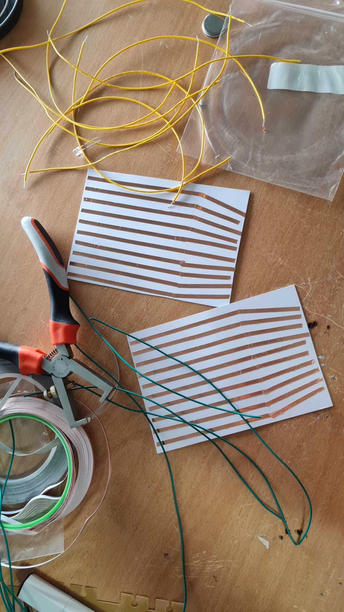

## Sensorintegratie

## Hoe kan ik het kleed laten activeren?

### 1. Gewichtssensoren / Druksensoren
- **Drukgevoelige Pads**: Ik kan druksensoren gebruiken die het licht aanzetten wanneer er druk op wordt uitgeoefend. Dit biedt een alternatieve manier om interactie te detecteren en het licht te activeren.
  - *Integratie*: Deze sensor kan worden gebruikt om gebieden te detecteren waar druk wordt uitgeoefend en vervolgens de verlichting te regelen. Ze kunnen ook meten hoeveel gewicht er op specifieke plekken van het kleed wordt geplaatst, waardoor het licht kan aangaan wanneer iemand erop staat of drukt.

- **Load Cell**:
  - *Wat is het?*: Load cells meten fysieke kracht, meestal druk of gewicht, en zetten deze om in elektrische signalen.
  - *Gebruik*: Ik kan ze onder het kleed plaatsen om het gewicht van een persoon te detecteren. In combinatie met een versterker (bijv. HX711) kunnen ze zelfs lichte druk meten.

- [Kapton + Copper Matrix](https://www.kobakant.at/DIY/?p=7443) Deze matrix kan worden gebruikt om druk te meten over een groter oppervlak, wat kan helpen bij het activeren van het licht op basis van waar iemand staat, zit of drukt.

### 2. Touchsensoren
- **Capacitive Touch Sensors**: Het gebruik van capacitive touch sensors maakt het mogelijk om het licht in te schakelen wanneer iemand het werkstuk aanraakt. Deze sensors detecteren veranderingen in elektrische capaciteit door aanraking en kunnen worden aangesloten op een microcontroller die de LEDs aanstuurt.
  - *Instellingen en Aanpassingen*: Het is belangrijk dat de sensors correct zijn afgesteld en gevoelig genoeg zijn om te reageren op aanraking zonder ongewenste valse triggers.

  - **Capacitieve Touchsensor (bijv. TTP223)**:
    - *Wat is het?*: Deze sensoren meten veranderingen in capacitieve lading wanneer ze worden aangeraakt. Ze reageren op lichte aanraking en kunnen discreet onder de stof van het kleed worden geplaatst.
    - *Gebruik*: Geschikt voor het detecteren van aanrakingen op het oppervlak van het kleed. Ze zijn eenvoudig te gebruiken en kunnen gemakkelijk worden geïntegreerd in een interactief lichtsysteem.

- **Force Sensitive Resistor (FSR)**:
  - *Wat is het?*: Dit is een druksensor die weerstand meet afhankelijk van de druk die erop wordt uitgeoefend. Hoe harder de druk, hoe lager de weerstand.
  - *Gebruik*: Ze kunnen onder het kleed of in de tuftlagen worden geplaatst om zachte druk of aanrakingen te meten. Ze reageren goed op zowel druk als aanraking.

- [Force Sensitive Resistor uitleg](https://www.youtube.com/watch?v=qjruYfwsOaI)  
  (Kan dit achter het hele kleed?)

### 3. Afstandssensoren
- **Bewegingssensoren**: Het gebruik van een bewegingssensor zoals een PIR-sensor (Passieve Infraroodsensor) kan helpen om licht te activeren op basis van beweging.
  - *Instelbare Sensitiviteit*: Het is belangrijk dat de sensitiviteit van de bewegingssensor kan worden aangepast om alleen te reageren op relevante bewegingen.

- **Ultrasone Afstandssensor (HC-SR04)**:
  - *Wat is het?*: Een ultrasone sensor die geluidsgolven gebruikt om de afstand tot een object te meten. Het is een betrouwbare en goedkope sensor voor korte afstanden.
  - *Gebruik*: Deze sensoren kunnen worden gebruikt om de afstand te meten en het licht in te schakelen wanneer iemand het kleed nadert. 

- **IR Afstandssensor (bijv. Sharp GP2Y0A02YK0F)**:
  - *Wat is het?*: Een infrarood afstandssensor die infrarood licht gebruikt om de afstand te meten. Hij werkt goed op korte tot middellange afstanden en is iets nauwkeuriger dan ultrasone sensoren.
  - *Gebruik*: Deze kan ook aan de rand van het kleed worden geplaatst om beweging te detecteren wanneer iemand in de buurt komt.

- **Kinect**:
  - *Wat is het?*: Een camera die kan worden gebruikt om beweging en personen te detecteren.

- **Sensor mm Wave**:
    - *Wat is het?*: Deze sensor kan worden gebruikt om beweging te detecteren, wat je in staat stelt om het licht te activeren wanneer iemand in de buurt komt. Het biedt een goede activeringsoptie zonder dat de gebruiker het kleed hoeft aan te raken.

- **Break Beam Sensor**:
      - *Wat is het?*: Deze sensor kan worden gebruikt om te detecteren wanneer een object de lichtstraal onderbreekt, waardoor het een trigger kan zijn voor verlichting.

### 4. Knop of Schakelaar
- **Handmatige Controle**: Voor een eenvoudigere benadering kun je een knop of schakelaar integreren in je werkstuk die het licht in- en uitschakelt. Dit kan een fysieke knop zijn die de verlichting regelt.

### 5. Microcontroller en Programmatie
- **Arduino of andere Microcontrollers**: Door een microcontroller zoals een Arduino te gebruiken, kan ik deze programmeren om de verschillende sensoren te lezen en op basis van die input de LEDs aan te sturen. Dit biedt veel flexibiliteit en controle over hoe en wanneer het licht aan en uit gaat.
- **Code Voorbeeld**: Ik kan een eenvoudige code schrijven die de sensorwaarden leest en op basis van die waarden de LEDs in- of uitschakelt. Er zijn veel voorbeelden en bibliotheken beschikbaar die me kunnen helpen met dit soort projecten.


### Touch Foil Screen
- **Wat is het?**: Met een touch foil screen kunnen gebruikers interactie hebben met het werkstuk door te tikken of te vegen. Het is een dunne, transparante folie die op het oppervlak van het werkstuk wordt aangebracht en die aanrakingen kan detecteren.
  - **Gebruik**: Dit type scherm maakt het mogelijk om een intuïtieve gebruikerservaring te creëren, waarbij gebruikers verschillende functies of instellingen kunnen activeren door aanraking.

### Scherm met Touch Screen
- **Wat is het?**: Een touch screen is een interactief scherm dat reageert op aanraking, waardoor gebruikers eenvoudig kunnen navigeren door verschillende opties. Het scherm kan verschillende lichtinstellingen en interacties aanbieden.
- **Gebruik**: Gebruikers kunnen met hun vingers op het scherm drukken om functies in te schakelen of instellingen aan te passen. Dit biedt een gebruiksvriendelijke interface voor het bedienen van verlichting en andere interactieve elementen in het werkstuk, zoals het kiezen van kleuren of het instellen van de helderheid.


## Kapton + Copper Matrix

Ik wil beginnen met het maken van de:
- [Kapton + Copper Matrix](https://www.kobakant.at/DIY/?p=7443)

Ik denk dat ik hiermee de beste resultaten kan halen. Ik heb de producten besteld en ga hier mee testen veel producten zoals de geleidende verf heb ik nog nooit mee gewerkt dus zal ik ook beginnende experimenten mee doen om te kijken hoe het werkt en hoe het reageert.

Wat ik heirvoor nodig/besteld en hoe ik getest heb:

- Kapton-tape: Dit is een dunne, flexibele, hittebestendige tape die vaak wordt gebruikt in elektronica. Het dient als de isolator in de matrix.

- Kopertape of woven geleidende tape: Een zelfklevende tape gemaakt van koper of gelijdende draad, die als geleidende laag dient in je sensor.

<div style="display: flex; justify-content: space-between;">
    
    
    
</div>

<div style="display: flex; justify-content: space-between;">
    
    
    
</div>

- Elektrische geleidende verf: Als alternatief voor kopertape kun je geleidende verf gebruiken om patronen te schilderen op de Kapton-tape.

<div style="display: flex; justify-content: space-between;">
    
    
    
</div>

- Solderen of geleidend lijm: Dit is nodig om de kopertape met de rest van je circuit te verbinden.

- Draden of kabels: Om de kopertape of geleidende verf aan te sluiten op de elektronische componenten (zoals een microcontroller).

- Microcontroller (bijv. Arduino of ESP): Deze is nodig om de signalen van de matrixsensor te verwerken en verdere acties (zoals het activeren van verlichting) aan te sturen.

Ik ben begonnen met de koper tape de Matrix te maken op karton. Ik heb de coper tape beverstigd en daaraan draden gesoldeerd. Vervolgens heb ik getest of het de stroom nog wel geleid door dit te meten.

<div style="display: flex; justify-content: space-between;">
    
    
    
</div>

<div style="display: flex; justify-content: space-between;">
    
    
</div>

Helaas werkt mijn code nog niet dus ben er nog druk mee bezig maar het is wel gelukt een soort meting te maken. 

<div style="display: flex; justify-content: space-between;">
    
</div>

Na mijn code meerdere keren opnieuw proberen heb ik besloten een paar stappen terug tegaan en na te maken wat ook gedaan is op [Kapton + Copper Matrix](https://www.kobakant.at/DIY/?p=7443). Door dit te doen hoop ik de code beter te kunnen begrijpen en te kunnen opschalen inplaats van gelijk groter te willen en proberen zonder dat ik weet wat ik doe.

Ik ben dus stap voor stap begonnen. Eerst heb ik de Kapton tape dubbel geplakt om er een film van te hebben zonder plakkende kanten om vervolgens daar kopertape op te plakken met de zelfde afstand er tussen. Dit heb ik gedaan door tape in strookjes te snijden in de zelfde breedte als de tape. 

<div style="display: flex; justify-content: space-between;">
    
    
        
    
      
</div>

Daarna heb ik 3 vierkantjes uitgesneden en heb ik op een overig stukje geoevend met solderen om het vervolgens op de twee vierkante stukjes te doen. 

<div style="display: flex; justify-content: space-between;">
    
        
      
    
</div>

De volgende stap is het conecten van mijn esp omdat dat ook gedaan wordt in mij voorbeeld.
De esp koppelen aan arduino was even uitzoekken maar uiteindelijk deze [video](https://www.youtube.com/watch?v=BtSE0TeybfI) gevonden die het proces uitlegde. 

Helaas werkte de code van mijn voorbeeld website niet gelijk helemaal maar dit is de bedoeling ervan.

Ik sluit de colommen en rijen aan op de volgende pins.

  int rows[] = {36, 39, 34, 35, 32, 33, 25}; 

  int cols[] = {0, 4, 16, 17, 5, 18, 19};

De rijen zitten op analoge pinnen en de colommen op digitale pinnen. De digitale pinnen kunnen alleen aangeven of een verbinding hoog of laag is, analoge ingangspinnen kunnen de exacte spanningswaarde lezen. De analoge pinnen ontvangen dus in dit geval en de digitale pinnen zenden. Het is de bedoeling dat deze op elkaar komen te liggen met een stuk velostat er tussen. *Velostat* is drukgevoelig knijpen of drukken vermindert de weerstand en is daarom handig voor het maken van flexibele sensoren.

De rijen moeten dus altijd 0 zijn en de kollommen zijn 3.3 volt. als je druk zet op de sensor verminderd ve weerstand van de velostat en wortd er dus stroom doorgegeven van de kolommen naar de rijen. Dit gebeurt alleen niet helemaal en de rijen geven altijd een diverse en hoge weerstand. Dit wordt ook wel floating values genoemd. 

Bij het testen in the progressing werkte het een beetje maar hij leek niet accuraat te zijn en ook steeds verbinding te krijgen op andere punten. 

<div style="display: flex; justify-content: space-between;">
    
        
      
</div>


# Touch Foil Screen

Omdat de kapton + Copper Matrix nog niet helemaal werkt tot nu ben ik een onderzoek gestart naar Touch Foil Screens. 

Touchscreenfolie is een transparante, ultradunne film die op een glazen of acryl oppervlak kan worden aangebracht om er een aanraakgevoelige interface van te maken.

Hoe ik dit voormij kan zien in mijn project is direct achter mijn kleed waar de glasvezel draden al als kleine spijkertjes in zitten. De folie is aangebracht op een acryle plaat met daar achter de matric van ledverlichting. Als je het kleed dan aanraakt activeer je de foil die dan weet welke ledjes aan moeten gaan. 

Voor dit onderzoek heb ik een paar onderzoeksvragen:
- #### Kun je de Touchscreenfolie gebruiken met meer mensen?
- #### Kun je de Touchscreenfolie activeren met heel je hand?
- #### Waar kun je de Touchscreenfolie aan aansluiten? (Alllen computer of ook arduino/rasberry)
- #### Wat is de prijs?


### Kun je de Touchscreenfolie gebruiken met meer mensen?
Door de volgende videos van Crystal Display Systems lijkt het wel te doen te zijn dat meer vinger de schermen kunnen aanraken.
[Video 1](https://www.youtube.com/watch?v=qTnkiDjIwkw)
[Video 2](https://www.youtube.com/watch?v=oROzLeuFUMY)

Ook deze video van sinotectronicsinc laat zien dat het scherm gebruikt kan worden met meerdere vingers.
[Video 3](https://www.youtube.com/watch?v=IKWe42lk_sY)

https://crystal-display.com/touchscreen-sensors-touch-panels-and-touch-controllers/

### Kun je de Touchscreenfolie activeren met heel je hand?
Dit heb ik niet direct kunnen vinden.

### Waar kun je de Touchscreenfolie aan aansluiten? (Alllen computer of ook arduino/rasberry)
De touch foil is verbonden met een controller, die verantwoordelijk is voor het verwerken van de touch input signalen en het communiceren met het besturingssysteem van het apparaat. De controller interpreteert de touch data en vertaalt deze naar commando's of coördinaten die het systeem kan begrijpen.

- Usb
  Volgens [Ssidispays](https://ssidisplays.com/touch-foils/#:~:text=Single%20USB%20Connection,board%20on%20your%20Touch%20Foil.) kun je Touchscreenfolie aansluiten doormiddel van een usb.

Je kunt [Starterkits](https://www.sossolutions.nl/raspberry-4b-touchscreen-starterkit) aanschaffen voor de conectie van een touchscreen met Raspberry dus ik ga er van uit dat het ook mogelijk is met een Toutch screen foil.

### Wat is de prijs?
De prijs van de folie is erg vershcillend en licht ook aan de soort folie die je wilt.

De 3 websites die ik gevonden heb die de Touchscreenfolie verkopen:

https://ssidisplays.com/

https://www.interactivetouch-screen.com/

https://crystal-display.com/

https://www.frontfolies.com/en/

[https://www.exportworldwide.com/nl/](https://www.exportworldwide.com/nl/company/visualplanet/touch-folie-voor-glas-zet-vensters-om-in-aanraakschermen)

https://tycotouch.com/


bijna alle prijzen zijn daar op aanvraag behalve bij [Tycotoutch](https://tycotouch.com/) met die informatie ga ik uit van die prijzen en dat verschilt tussen de €100 en €700 licht aan de groote. Op websites zoals aliexpress staan ze ook voor zulke prijsen en af en toe vind je er een voor een stuk goedkoper.

Ik heb de bovengenoemde bedrijven behalve [https://www.exportworldwide.com/nl/](https://www.exportworldwide.com/nl/company/visualplanet/touch-folie-voor-glas-zet-vensters-om-in-aanraakschermen) de volgende mail gemaild:

```
Subject: Request Regarding Touch Foil Screens for Interactive Project

Dear [Company Name],

I hope you’re doing well. My name is Rianne, and I am currently in my exam year at the St. Joost School of Design and Art. As part of my final project, I am exploring the integration of technology with textiles, and I am particularly interested in the use of touch foil screens.

In this project, I plan to use the touch foil screen in combination with fiber optic threads embedded in a rug, where the foil will trigger LED lights based on touch input.

I have a few questions about your touch foil screens to understand if they are suitable for my project:
1.	Can the touch foil screen support input from multiple users simultaneously?
2.	Is it possible to activate the touch foil using the entire hand, or is it limited to just fingers?
3.	What devices can the touch foil be connected to? (Is it compatible only with computers, or can it also work with microcontrollers like Arduino or Raspberry Pi?)
4.	Could you provide information on the pricing for your touch foil options?
5.	Is it possible to activate the touch foil through a layer of material, such as a rug or rubber? In my case, the foil would be placed behind a textile surface, and I would love to know if the touch functionality would still work through such materials.

For reference, you can view a previous project of mine, Bedraden Draden, on my [Instagram](https://www.instagram.com/rianne.schoenmacker/). This project showcases a similar setup, though without capacitive sensors or extensive use of fiber optic wires, which I plan to incorporate into this new design.

I would be grateful if it were possible to receive a test sample or potentially a panel which would be discarded because of any imperfections. This would also be better for the environment and more sustainable. This I can then use to evaluate its performance in the context of my project. 

Thank you for your time and consideration. I look forward to your response.

With kind regards,

Rianne Schoenmacker
```


