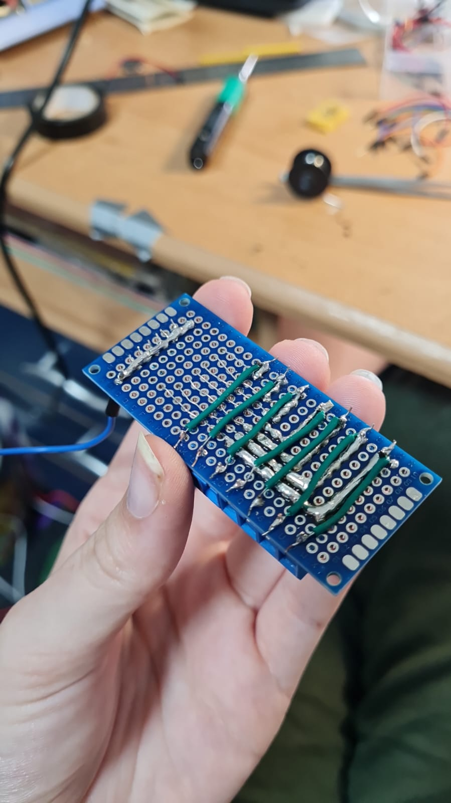

## Sensorintegratie

## Hoe kan ik het kleed laten activeren?

### 1. Gewichtssensoren / Druksensoren
- **Drukgevoelige Pads**: Ik kan druksensoren gebruiken die het licht aanzetten wanneer er druk op wordt uitgeoefend. Dit biedt een alternatieve manier om interactie te detecteren en het licht te activeren.
  - *Integratie*: Deze sensor kan worden gebruikt om gebieden te detecteren waar druk wordt uitgeoefend en vervolgens de verlichting te regelen. Ze kunnen ook meten hoeveel gewicht er op specifieke plekken van het kleed wordt geplaatst, waardoor het licht kan aangaan wanneer iemand erop staat of drukt.

- **Load Cell**:
  - *Wat is het?*: Load cells meten fysieke kracht, meestal druk of gewicht, en zetten deze om in elektrische signalen.
  - *Gebruik*: Ik kan ze onder het kleed plaatsen om het gewicht van een persoon te detecteren. In combinatie met een versterker (bijv. HX711) kunnen ze zelfs lichte druk meten.

- [Kapton + Copper Matrix](https://www.kobakant.at/DIY/?p=7443) Deze matrix kan worden gebruikt om druk te meten over een groter oppervlak, wat kan helpen bij het activeren van het licht op basis van waar iemand staat, zit of drukt.

### 2. Touchsensoren
- **Capacitive Touch Sensors**: Het gebruik van capacitive touch sensors maakt het mogelijk om het licht in te schakelen wanneer iemand het werkstuk aanraakt. Deze sensors detecteren veranderingen in elektrische capaciteit door aanraking en kunnen worden aangesloten op een microcontroller die de LEDs aanstuurt.
  - *Instellingen en Aanpassingen*: Het is belangrijk dat de sensors correct zijn afgesteld en gevoelig genoeg zijn om te reageren op aanraking zonder ongewenste valse triggers.

  - **Capacitieve Touchsensor (bijv. TTP223)**:
    - *Wat is het?*: Deze sensoren meten veranderingen in capacitieve lading wanneer ze worden aangeraakt. Ze reageren op lichte aanraking en kunnen discreet onder de stof van het kleed worden geplaatst.
    - *Gebruik*: Geschikt voor het detecteren van aanrakingen op het oppervlak van het kleed. Ze zijn eenvoudig te gebruiken en kunnen gemakkelijk worden geïntegreerd in een interactief lichtsysteem.

- **Force Sensitive Resistor (FSR)**:
  - *Wat is het?*: Dit is een druksensor die weerstand meet afhankelijk van de druk die erop wordt uitgeoefend. Hoe harder de druk, hoe lager de weerstand.
  - *Gebruik*: Ze kunnen onder het kleed of in de tuftlagen worden geplaatst om zachte druk of aanrakingen te meten. Ze reageren goed op zowel druk als aanraking.

- [Force Sensitive Resistor uitleg](https://www.youtube.com/watch?v=qjruYfwsOaI)  
  (Kan dit achter het hele kleed?)

### 3. Afstandssensoren
- **Bewegingssensoren**: Het gebruik van een bewegingssensor zoals een PIR-sensor (Passieve Infraroodsensor) kan helpen om licht te activeren op basis van beweging.
  - *Instelbare Sensitiviteit*: Het is belangrijk dat de sensitiviteit van de bewegingssensor kan worden aangepast om alleen te reageren op relevante bewegingen.

- **Ultrasone Afstandssensor (HC-SR04)**:
  - *Wat is het?*: Een ultrasone sensor die geluidsgolven gebruikt om de afstand tot een object te meten. Het is een betrouwbare en goedkope sensor voor korte afstanden.
  - *Gebruik*: Deze sensoren kunnen worden gebruikt om de afstand te meten en het licht in te schakelen wanneer iemand het kleed nadert. 

- **IR Afstandssensor (bijv. Sharp GP2Y0A02YK0F)**:
  - *Wat is het?*: Een infrarood afstandssensor die infrarood licht gebruikt om de afstand te meten. Hij werkt goed op korte tot middellange afstanden en is iets nauwkeuriger dan ultrasone sensoren.
  - *Gebruik*: Deze kan ook aan de rand van het kleed worden geplaatst om beweging te detecteren wanneer iemand in de buurt komt.

- **Kinect**:
  - *Wat is het?*: Een camera die kan worden gebruikt om beweging en personen te detecteren.

- **Sensor mm Wave**:
    - *Wat is het?*: Deze sensor kan worden gebruikt om beweging te detecteren, wat je in staat stelt om het licht te activeren wanneer iemand in de buurt komt. Het biedt een goede activeringsoptie zonder dat de gebruiker het kleed hoeft aan te raken.

- **Break Beam Sensor**:
      - *Wat is het?*: Deze sensor kan worden gebruikt om te detecteren wanneer een object de lichtstraal onderbreekt, waardoor het een trigger kan zijn voor verlichting.

### 4. Knop of Schakelaar
- **Handmatige Controle**: Voor een eenvoudigere benadering kun je een knop of schakelaar integreren in je werkstuk die het licht in- en uitschakelt. Dit kan een fysieke knop zijn die de verlichting regelt.

### 5. Microcontroller en Programmatie
- **Arduino of andere Microcontrollers**: Door een microcontroller zoals een Arduino te gebruiken, kan ik deze programmeren om de verschillende sensoren te lezen en op basis van die input de LEDs aan te sturen. Dit biedt veel flexibiliteit en controle over hoe en wanneer het licht aan en uit gaat.
- **Code Voorbeeld**: Ik kan een eenvoudige code schrijven die de sensorwaarden leest en op basis van die waarden de LEDs in- of uitschakelt. Er zijn veel voorbeelden en bibliotheken beschikbaar die me kunnen helpen met dit soort projecten.


### Touch Foil Screen
- **Wat is het?**: Met een touch foil screen kunnen gebruikers interactie hebben met het werkstuk door te tikken of te vegen. Het is een dunne, transparante folie die op het oppervlak van het werkstuk wordt aangebracht en die aanrakingen kan detecteren.
  - **Gebruik**: Dit type scherm maakt het mogelijk om een intuïtieve gebruikerservaring te creëren, waarbij gebruikers verschillende functies of instellingen kunnen activeren door aanraking.

### Scherm met Touch Screen
- **Wat is het?**: Een touch screen is een interactief scherm dat reageert op aanraking, waardoor gebruikers eenvoudig kunnen navigeren door verschillende opties. Het scherm kan verschillende lichtinstellingen en interacties aanbieden.
- **Gebruik**: Gebruikers kunnen met hun vingers op het scherm drukken om functies in te schakelen of instellingen aan te passen. Dit biedt een gebruiksvriendelijke interface voor het bedienen van verlichting en andere interactieve elementen in het werkstuk, zoals het kiezen van kleuren of het instellen van de helderheid.


## Kapton + Copper Matrix

Ik wil beginnen met het maken van de:
- [Kapton + Copper Matrix](https://www.kobakant.at/DIY/?p=7443)

Ik denk dat ik hiermee de beste resultaten kan halen. Ik heb de producten besteld en ga hier mee testen. Veel producten, zoals de geleidende verf, heb ik nog nooit mee gewerkt, dus zal ik ook beginnende experimenten mee doen om te kijken hoe het werkt en hoe het reageert.

### Wat ik hiervoor nodig/besteld en hoe ik getest heb:

- Kapton-tape: Dit is een dunne, flexibele, hittebestendige tape die vaak wordt gebruikt in elektronica. Het dient als de isolator in de matrix.

- Kopertape of : Zoals de naam al aangeeft, is deze tape gemaakt van koper. Het heeft uitstekende geleidende eigenschappen en is vaak dun en flexibel.
    - *Toepassing*: Kopertape wordt vaak gebruikt in elektronische projecten, zoals bij het maken van circuits op een klein oppervlak. Het is ook populair voor het afschermen van elektromagnetische interferentie (EMI).
    - *Geleidendheid*: Heeft over het algemeen een lagere weerstand en kan betere prestaties bieden voor het overdragen van elektrische signalen.
    - *Flexibiliteit en duurzaamheid*: Is redelijk flexibel, maar kan breken of vervormen als het te veel wordt belast of verkeerd wordt gebruikt.
    - *Prijsklasse*: Kan variëren in prijs, maar is meestal betaalbaar voor de meeste hobbyprojecten.

- Woven geleidende tape: Deze tape is gemaakt van geweven stoffen, meestal met geleidende materialen zoals koolstof of metaalcoatings. Het kan ook een combinatie van synthetische vezels en geleidend materiaal bevatten.
    - *Toepassing*: Woven geleidende tape wordt vaak gebruikt in toepassingen waarbij flexibiliteit en duurzaamheid belangrijk zijn, zoals bij het afschermen van kabels, het verbinden van geleiders of in textieltoepassingen. Het kan ook gebruikt worden voor het beschermen tegen statische elektriciteit.
    - *Geleidendheid*: Hoewel ook geleidend, kan de weerstand variëren afhankelijk van de gebruikte materialen en de dichtheid van de weving. Dit kan de effectiviteit beïnvloeden bij bepaalde toepassingen.
    - *Flexibiliteit en duurzaamheid*: Is meestal flexibeler en kan beter tegen belasting, wat het geschikt maakt voor gebruik in omgevingen waar beweging of vervorming kan optreden.
     - *Prijsklasse*: Kan vaak duurder zijn, afhankelijk van de gebruikte materialen en de specifieke toepassing.


<div style="display: flex; justify-content: space-between;">
    
    
    
</div>

<div style="display: flex; justify-content: space-between;">
    
    
    
</div>

- Elektrische geleidende verf: Deze verf is gemaakt van een bindmiddel waarin geleidende deeltjes, zoals koolstof, zilver of koper, zijn opgelost. Dit maakt het mogelijk om een geleidende laag te creëren wanneer de verf droogt.
   - *Toepassing*: Elektrische geleidende verf wordt vaak gebruikt voor het aanbrengen van elektrische verbindingen op niet-conventionele oppervlakken, zoals kunststof, hout of textiel. Het is ook handig voor het maken van zelfgemaakte schakelingen, het repareren van printplaten, en het creëren van geleidende patronen voor sensor- of touchscreen-toepassingen.
   - *Geleidendheid*: Hoewel het geleidend is, kan de geleidbaarheid variëren afhankelijk van de gebruikte deeltjes en de concentratie. De geleidbaarheid is doorgaans lager dan die van kopertape of woven geleidende tape, wat betekent dat het minder geschikt is voor toepassingen waar hoge prestaties of lage weerstand vereist zijn.
   - *Flexibiliteit en duurzaamheid*: Wanneer het goed is aangebracht en volledig is uitgehard, kan de verf redelijk flexibel zijn, maar kan deze ook breken of schilferen bij te veel belasting. De duurzaamheid hangt sterk af van de ondergrond en de omgeving waarin het wordt gebruikt.
   - *Prijsklasse*: De prijs varieert afhankelijk van de kwaliteit en de samenstelling van de verf, maar het kan over het algemeen duurder zijn dan kopertape, vooral bij gebruik van hoogwaardige geleidende materialen zoals zilver.

<div style="display: flex; justify-content: space-between;">
    
    
    
</div>

- Solderen: Solderen is een proces waarbij een soldeertin (meestal een legering van tin en lood, of tin en zilver) wordt verwarmd tot het smelt en vervolgens wordt gebruikt om twee of meer elektrische verbindingen aan elkaar te hechten.

- Draden of kabels: Om de kopertape of geleidende verf aan te sluiten op de elektronische componenten (zoals een microcontroller).

- Microcontroller (bijv. Arduino of ESP): Deze is nodig om de signalen van de matrixsensor te verwerken en verdere acties (zoals het activeren van verlichting) aan te sturen.

Ik ben begonnen met de kopertape de Matrix te maken op karton. Ik heb de kopertape bevestigd en daaraan draden gesoldeerd. Vervolgens heb ik getest of het de stroom nog wel leidde door dit te meten met een multimeter.

<div style="display: flex; justify-content: space-between;">
    
    
    
</div>

<div style="display: flex; justify-content: space-between;">
    
    
</div>

Helaas werkt mijn code nog niet dus ben er nog druk mee bezig maar het is wel gelukt een soort meting te maken. 

<div style="display: flex; justify-content: space-between;">
    
</div>

Na mijn code meerdere keren opnieuw proberen, heb ik besloten een paar stappen terug te gaan en na te maken wat ook gedaan is op [Kapton + Copper Matrix](https://www.kobakant.at/DIY/?p=7443). Door dit te doen hoop ik de code beter te kunnen begrijpen en te kunnen opschalen in plaats van gelijk groter te willen en proberen zonder dat ik weet wat ik doe.

Ik ben dus stap voor stap begonnen. Eerst heb ik de Kapton tape dubbel geplakt om er een film van te hebben zonder plakkende kanten, om vervolgens daar kopertape op te plakken met de zelfde afstand er tussen. Dit heb ik gedaan door tape in strookjes te snijden in de zelfde breedte als de tape. 

<div style="display: flex; justify-content: space-between;">
    
    
        
    
      
</div>

Daarna heb ik 3 vierkantjes uitgesneden en heb ik op een overig stukje geoefend met solderen om het vervolgens op de twee vierkante stukjes te doen. 

<div style="display: flex; justify-content: space-between;">
    
        
      
    
</div>

De volgende stap is het verbinden van mijn esp omdat dat ook gedaan wordt in mij voorbeeld.
De esp koppelen aan Arduino was even uitzoeken maar uiteindelijk heb ik deze [video](https://www.youtube.com/watch?v=BtSE0TeybfI) gevonden die het proces uitlegde. 

Helaas werkte de code van mijn voorbeeld website niet gelijk helemaal maar dit is de bedoeling ervan.

Ik sluit de kolommen en rijen aan op de volgende pinnen.

```
int rows[] = {36, 39, 34, 35, 32, 33, 25}; 
int cols[] = {0, 4, 16, 17, 5, 18, 19};
```

De rijen zitten op analoge pinnen en de kolommen op digitale pinnen. De digitale pinnen kunnen alleen aangeven of een verbinding hoog of laag is; analoge ingangspinnen kunnen de exacte spanningswaarde lezen. De analoge pinnen ontvangen dus in dit geval en de digitale pinnen zenden. Het is de bedoeling dat deze op elkaar komen te liggen met een stuk velostat er tussen. *Velostat* is drukgevoelig: knijpen of drukken vermindert de weerstand en is daarom handig voor het maken van flexibele sensoren.

De rijen moeten dus altijd 0 zijn en de kolommen zijn 3.3 volt. Als je druk zet op de sensor verminderd de weerstand van de velostat en wordt er dus stroom doorgegeven van de kolommen naar de rijen. Dit gebeurt alleen niet helemaal, de rijen geven altijd een diverse en hoge weerstand. Dit wordt ook wel floating values genoemd. 

Bij het testen in de progressing werkte het een beetje maar hij leek niet accuraat te zijn en ook steeds verbinding te krijgen op andere punten. 

<div style="display: flex; justify-content: space-between;">
    
        
      
</div>

Omdat de rijen 'floating' zijn wat storingen veroorzaakte. Om dit te proberen te voorkomen, heb ik deze rijen via een weerstand verbonden met de ground pin. Door de weerstand ontstaat een 'pull-down' effect, dat ervoor zorgt dat de rijen standaard een lage (0V) spanning hebben wanneer ze niet actief worden aangestuurd.

<div style="display: flex; justify-content: space-between;">
    
        
</div>

Dit is de code die ik hierbij gebruikte heb om het te laten werken.

##### Arduino
```
/*
Matrix: Kapton + Copper
A simple pressure sensor matrix made from two Kapton film sheets with
7×7 copper tape traces and a piece of Velostat or Eeonyx piezoresistive
material in between.
*/

#define numRows 7
#define numCols 7
#define sensorPoints (numRows * numCols)

// ESP32-WROOM-32 Analog and Digital pin definitions
int rows[] = {36, 39, 34, 35, 32, 33, 25}; // Analog
int cols[] = {0, 4, 16, 17, 5, 18, 19}; // GPIO
int incomingValues[sensorPoints]={0};

void setup() {
    //Set all rows to INPUT_PULLDOWN to prevent floating values
    for (int i = 0; i < numRows; i++) {
        pinMode(rows[i], INPUT);
    }
    for (int i = 0; i < numCols; i++) {
        pinMode(cols[i], INPUT);
    }

    Serial.begin(9600);
    delay(1000);

    // pinMode(36, INPUT);
    // Serial.println(analogRead(36));
}

void loop() {
    // Reset incoming values

    for (int i = 0; i < sensorPoints; i++) {
        incomingValues[i] = 0;
    }

    // Iterate through each column
    for (int colCount = 0; colCount < numCols; colCount++) {
        pinMode(cols[colCount], OUTPUT);
        digitalWrite(cols[colCount], HIGH);

        // Read values from all rows in the current column
        for (int rowCount = 0; rowCount < numRows; rowCount++) {
            int rawValue = analogRead(rows[rowCount]);
            if (rawValue < 20) {
                incomingValues[colCount * numRows + rowCount] = 0;
            } else {
                incomingValues[colCount * numRows + rowCount] = rawValue;
            }
        }
        digitalWrite(cols[colCount], LOW);
        pinMode(cols[colCount], INPUT);
    }

    // Print the incoming values of the sensor grid
    for (int i = 0; i < sensorPoints; i++) {
        Serial.print(incomingValues[i]);
        if (i < sensorPoints - 1) {
            Serial.print("\t");
        }
    }

    Serial.println();
    delay(100);  // Adjusted delay for stability
}
```
##### Processing
```
import processing.serial.*;

Serial myPort; // The serial port
int maxNumberOfSensors = 49;
float[] sensorValue = new float[maxNumberOfSensors]; // Global variable for storing mapped sensor values
float[] previousValue = new float[maxNumberOfSensors]; // Previous values for smoothing
int rectSize = 0;

void setup() {
    size(600, 600); // Set up the window
    rectSize = width / 7;

   println(Serial.list()); // List all the available serial ports
    String portName = Serial.list()[0]; // Adjust if needed, to pick the correct port
    myPort = new Serial(this, portName, 9600);
    myPort.clear();
    myPort.bufferUntil('\n'); // Wait for newline before triggering serialEvent
    background(255); // Set initial background
    smooth(); // Turn on antialiasing
    rectMode(CORNER);
}

void draw() {
    // Clear the screen each frame
    background(255); // Prevent flickering by refreshing the background

    // Reset rectY at the start of each draw
    int rectY = 0; 

    // Iterate through each sensor and draw rectangles
    for (int i = 0; i < maxNumberOfSensors; i++) {
        // Apply smoothing to the sensor values
        sensorValue[i] = 0.9 * sensorValue[i] + 0.1 * previousValue[i];
        fill(sensorValue[i]);
        rect(rectSize * (i % 7), rectY, rectSize, rectSize); // Draw rectangle

        if ((i + 1) % 7 == 0) {
            rectY += rectSize; // Move to next row after 7 columns
        }
    }
}

void serialEvent(Serial myPort) {
    String inString = myPort.readStringUntil('\n'); // Get the ASCII string
    if (inString != null) { // If it's not empty
        inString = trim(inString); // Trim off any whitespace
        int incomingValues[] = int(split(inString, "\t")); // Convert to an array of ints
        if (incomingValues.length <= maxNumberOfSensors && incomingValues.length > 0) {
            for (int i = 0; i < incomingValues.length; i++) {
                previousValue[i] = map(incomingValues[i], 0, 1023, 0, 255);
            }
        }
    }
}
```

Waarna hij best accuraat werkte, niet ideaal, maar dat komt waarschijnlijk ook door de manier dat de rijen en kolommen op elkaar lagen. Het raster is zwart en bij pressure gaat hij van lichtgrijs naar wit.

<div style="display: flex; justify-content: space-between;">
    
        
</div>

Ik heb geprobeerd de sensor te koppelen aan de licht matrix. Helaas is dit nog zonder succes gegaan. 

<div style="display: flex; justify-content: space-between;">
    
        
</div>

# Touch Foil Screen

Omdat de kapton + Copper Matrix nog niet helemaal werkt, ben ik begonnen met een onderzoek naar Touch Foil Screens. 

Touchscreen folie is een transparante, ultradunne film die op een glazen of acryl oppervlak kan worden aangebracht om er een aanraakgevoelige interface van te maken.

Hoe ik dit in mijn project voor mij zie, is door de folie direct achter mijn kleed te plaatsen, waar de glasvezeldraden al als kleine spijkertjes in zitten. De folie wordt aangebracht op een acrylplaat met daarachter de matrix van LED-verlichting. Wanneer je het kleed aanraakt, activeer je de folie, die dan weet welke LED's moeten aangaan. 

Voor dit onderzoek heb ik een paar onderzoeksvragen:
- #### Kun je de Touchscreen folie gebruiken met meer mensen?
- #### Kun je de Touchscreen folie activeren met heel je hand?
- #### Waar kun je de Touchscreen folie aan aansluiten? (Alleen computer of ook Arduino/Raspberry)
- #### Wat is de prijs?


### Kun je de Touchscreen folie gebruiken met meer mensen?
Aan de hand van de volgende video's van Crystal Display Systems lijkt het mogelijk dat meerdere vingers de schermen kunnen aanraken.

[Video 1](https://www.youtube.com/watch?v=qTnkiDjIwkw)

[Video 2](https://www.youtube.com/watch?v=oROzLeuFUMY)

Ook deze video van sinotectronicsinc toont aan dat het scherm gebruikt kan worden met meerdere vingers.

[Video 3](https://www.youtube.com/watch?v=IKWe42lk_sY)

Meer informatie is te vinden op de website van Crystal Display Systems: https://crystal-display.com/touchscreen-sensors-touch-panels-and-touch-controllers/

### Kun je de Touchscreen folie activeren met heel je hand?
Dit heb ik niet direct kunnen vinden.

### Waar kun je de Touchscreen folie aan aansluiten? (Alleen computer of ook Arduino/Raspberry)
De touch folie is verbonden met een controller die verantwoordelijk is voor het verwerken van de aanraak input signalen en het communiceren met het besturingssysteem van het apparaat. De controller interpreteert de touch data en vertaalt deze naar commando's of coördinaten die het systeem kan begrijpen.

- Usb
  Volgens [Ssidispays](https://ssidisplays.com/touch-foils/#:~:text=Single%20USB%20Connection,board%20on%20your%20Touch%20Foil.) kun je Touchscreen folie aansluiten door middel van een usb.

Daarnaast kun je [Starterkits](https://www.sossolutions.nl/raspberry-4b-touchscreen-starterkit) aanschaffen voor de verbinding van een touchscreen met Raspberry dus ik ga er van uit dat het ook mogelijk is met een Touchscreen foil.

### Wat is de prijs?
De prijs van de folie is erg verschillend en licht aan de soort folie die je wilt.

De 6 websites die ik gevonden heb die de Touchscreen folie verkopen:

https://ssidisplays.com/

https://www.interactivetouch-screen.com/

https://crystal-display.com/

https://www.frontfolies.com/en/

[https://www.exportworldwide.com/nl/](https://www.exportworldwide.com/nl/company/visualplanet/touch-folie-voor-glas-zet-vensters-om-in-aanraakschermen)

https://tycotouch.com/


bijna alle prijzen zijn daar op aanvraag behalve bij [Tycotoutch](https://tycotouch.com/). Op basis van die informatie ga ik uit dat de prijzen variëren tussen de €100 en €700, afhankelijk van de grootte. Op websites zoals AliExpress vind je ook dergelijke prijzen en soms zelfs goedkopere opties.

Ik heb de bovengenoemde bedrijven, behalve [https://www.exportworldwide.com/nl/](https://www.exportworldwide.com/nl/company/visualplanet/touch-folie-voor-glas-zet-vensters-om-in-aanraakschermen) de volgende email g'gestuurd':

```
Subject: Request Regarding Touch Foil Screens for Interactive Project

Dear [Company Name],

I hope you’re doing well. My name is Rianne, and I am currently in my exam year at the St. Joost School of Design and Art. As part of my final project, I am exploring the integration of technology with textiles, and I am particularly interested in the use of touch foil screens.

In this project, I plan to use the touch foil screen in combination with fiber optic threads embedded in a rug, where the foil will trigger LED lights based on touch input.

I have a few questions about your touch foil screens to understand if they are suitable for my project:
1.	Can the touch foil screen support input from multiple users simultaneously?
2.	Is it possible to activate the touch foil using the entire hand, or is it limited to just fingers?
3.	What devices can the touch foil be connected to? (Is it compatible only with computers, or can it also work with microcontrollers like Arduino or Raspberry Pi?)
4.	Could you provide information on the pricing for your touch foil options?
5.	Is it possible to activate the touch foil through a layer of material, such as a rug or rubber? In my case, the foil would be placed behind a textile surface, and I would love to know if the touch functionality would still work through such materials.

For reference, you can view a previous project of mine, Bedraden Draden, on my [Instagram](https://www.instagram.com/rianne.schoenmacker/). This project showcases a similar setup, though without capacitive sensors or extensive use of fiber optic wires, which I plan to incorporate into this new design.

I would be grateful if it were possible to receive a test sample or potentially a panel which would be discarded because of any imperfections. This would also be better for the environment and more sustainable. This I can then use to evaluate its performance in the context of my project. 

Thank you for your time and consideration. I look forward to your response.

With kind regards,

Rianne Schoenmacker
```


