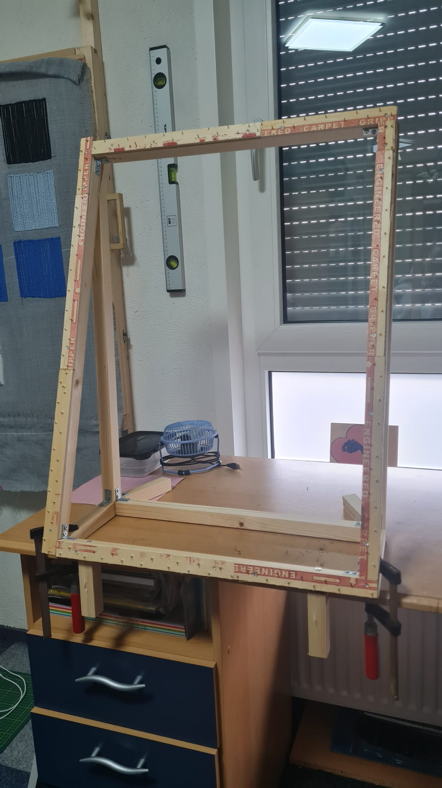
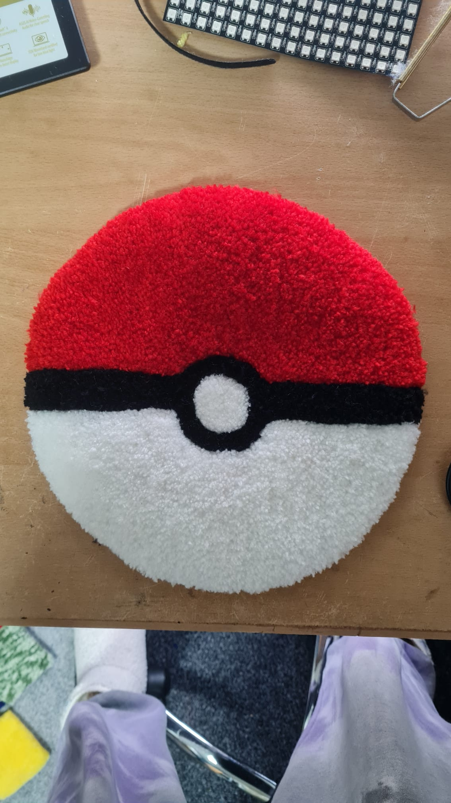
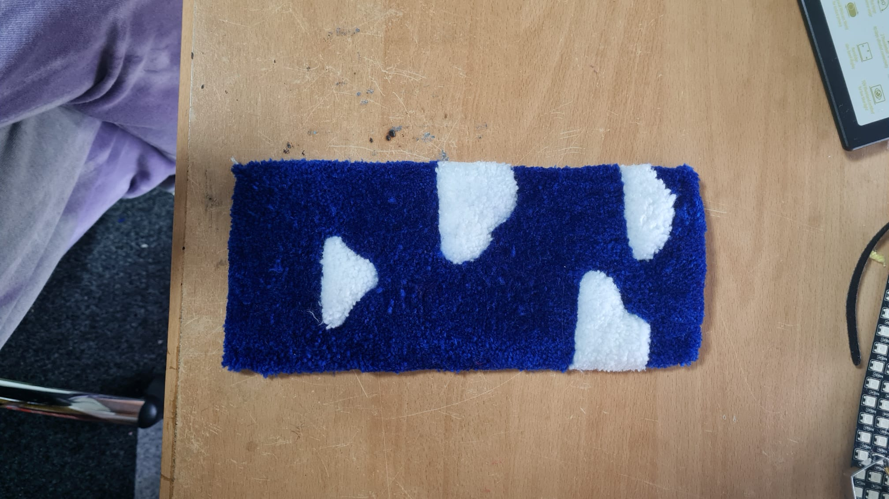

## Tufttechnieken

Ik ben begonnen met het maken kan kleedjes die je kan gebruiken op je bureau op het tuften te oefenen.

    

Deze heb ik gemaakt met meerdere kleedjes op een 1mx1m frame die ik zelf gemaakt heb. Om sneller kleine projecten te willen en kunnen tuften heb ik besloten een kleiner frame te maken.

Het kleine frame is 50 x 70 cm geworden.

    
      
      

Daarna ben ik gaan oefenen met de wol die ik al had liggen en om te testen of het frame zou blijven staan.

    
      
      

    
      
      
      

Ik merk dat ik het tuften los van de technologie ook moet blijven oefenen omdat het tuften en scheren daarvan ook een kunst is op zich.

Ik heb in de Zeeman een wol gevonden die reflecterend is.